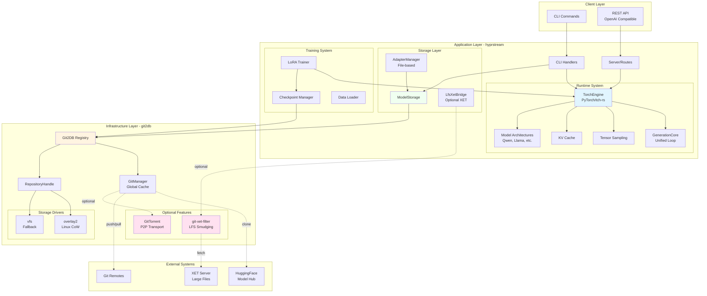
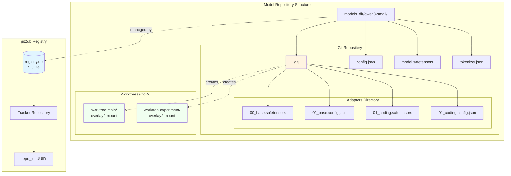
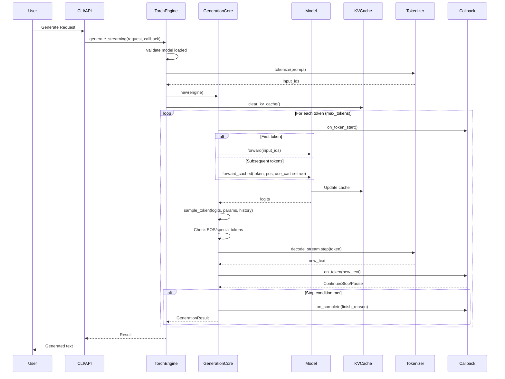
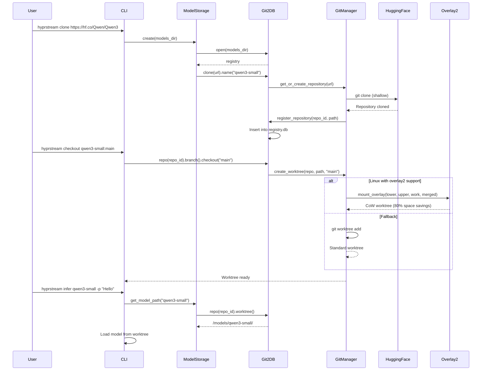
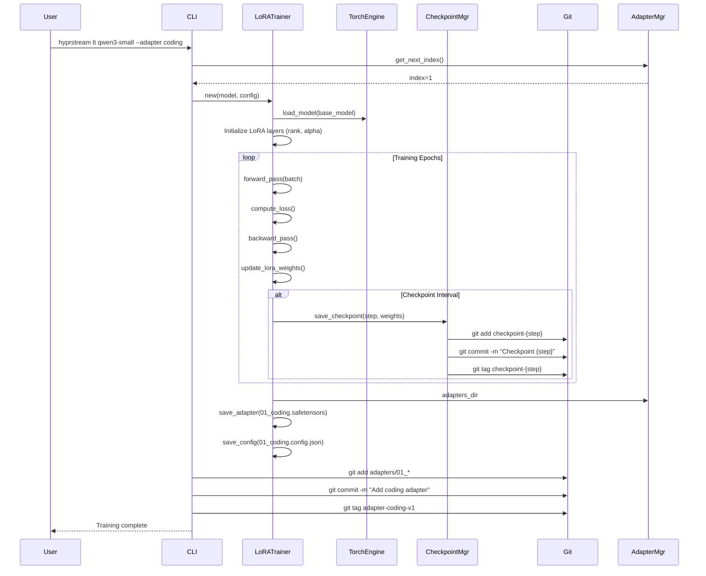
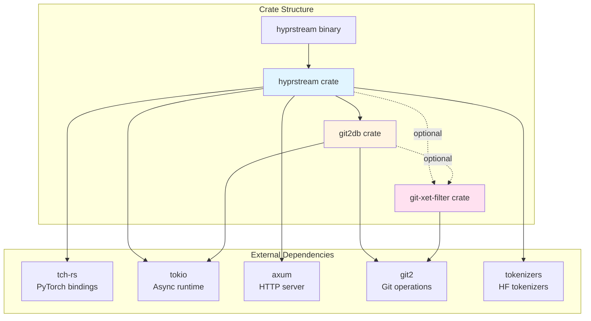

# hyprstream Architecture

This document provides visual diagrams of hyprstream's architecture and design patterns.

**Last Updated**: October 2025
**Status**: After adapter architecture simplification (file-based)

## Table of Contents

- [Overall System Architecture](#overall-system-architecture)
- [Storage Architecture](#storage-architecture)
- [Inference Flow](#inference-flow)
- [Model Loading & Git Integration](#model-loading--git-integration)
- [Adapter Architecture (File-Based)](#adapter-architecture-file-based)
- [XET/LFS Integration (Optional)](#xetlfs-integration-optional)
- [Training & Checkpoint Flow](#training--checkpoint-flow)
- [Component Dependencies](#component-dependencies)
- [Key Architectural Principles](#key-architectural-principles)

---

## Overall System Architecture

This diagram shows the complete system with all layers and their interactions.



**Key Components**:
- **TorchEngine**: PyTorch-based inference engine using tch-rs bindings
- **Git2DB**: Git repository management with SQLite registry
- **ModelStorage**: High-level model lifecycle management
- **AdapterManager**: File-based LoRA adapter system (simplified Oct 2025)
- **Optional Features**: XET for large files, GitTorrent for P2P

---

## Storage Architecture

Shows how models and adapters are organized on disk with git2db registry tracking.



**Storage Design**:
- Each model is a complete Git repository
- Adapters stored as numbered files in `adapters/` directory
- overlay2 provides ~80% disk space savings on Linux (CoW worktrees)
- SQLite registry tracks all repositories with UUIDs
- Worktrees allow multiple checkouts without duplicating data

---

## Inference Flow

Sequence diagram showing the complete inference pipeline from request to response.



**Inference Optimizations**:
- **KV Cache**: Reuses previous token computations
- **DecodeStream**: O(1) incremental token decoding
- **Unified Loop**: Single generation implementation (eliminates ~240 lines of duplication)
- **Streaming Callback**: Async token-by-token delivery
- **Repeat Penalty**: Only applied to generated tokens, not prompt

---

## Model Loading & Git Integration

Shows the complete flow of cloning a model and creating CoW worktrees.



**Git Integration Benefits**:
- Full version control for models and adapters
- Efficient storage with overlay2 CoW
- Standard git workflows (branch, commit, push, pull)
- Repository caching via GitManager singleton
- Automatic fallback to standard worktrees on non-Linux

---

## Adapter Architecture (File-Based)

File-based adapter system introduced in Oct 2025 simplification.

```mermaid
graph LR
    subgraph "Model Repository"
        BaseModel[Base Model<br/>model.safetensors]

        subgraph "adapters/ Directory"
            A0[00_base.safetensors<br/>00_base.config.json]
            A1[01_coding.safetensors<br/>01_coding.config.json]
            A2[02_chat.safetensors<br/>02_chat.config.json]
        end
    end

    subgraph "AdapterManager"
        List[list_adapters]
        NextIdx[get_next_index()]
        EnsureDir[ensure_adapters_dir()]
    end

    subgraph "LoRA Training"
        Trainer[LoRATrainer]
        SaveAdapter[save_adapter()]
        Dataset[Training Dataset]
    end

    subgraph "Git Operations"
        Stage[git add adapters/]
        Commit[git commit]
        Push[git push]
    end

    Dataset --> Trainer
    Trainer --> SaveAdapter
    SaveAdapter --> NextIdx
    NextIdx --> A2
    A2 --> Stage
    Stage --> Commit
    Commit --> Push

    List --> A0
    List --> A1
    List --> A2

    BaseModel -.->|applies| A0
    BaseModel -.->|applies| A1
    BaseModel -.->|applies| A2

    style BaseModel fill:#e1f5ff
    style A0 fill:#f0fff0
    style A1 fill:#f0fff0
    style A2 fill:#f0fff0
    style Trainer fill:#fff4e1
```

**Adapter Design** (Oct 2025):
- **File-based only**: Removed branch-based system (~1,000 lines deleted)
- **Indexed naming**: `00_base.safetensors`, `01_coding.safetensors`, etc.
- **Config files**: Each adapter has `.config.json` with metadata
- **Simple composition**: Stack multiple adapters
- **Git-tracked**: Committed like any other file
- **Fast loading**: Direct file I/O, no branch switching

**Removed** (Oct 2025):
- ❌ Branch-based adapters (experimental, unused)
- ❌ UUID adapter branches
- ❌ BranchManager (~387 lines)
- ❌ AdapterStorage (~600 lines)
- ❌ Tag alias resolution

---

## XET/LFS Integration (Optional)

Experimental large file handling via XET (disabled by default).

```mermaid
graph TB
    subgraph "Git Operations"
        Clone[git clone]
        Checkout[git checkout]
        Pull[git pull]
    end

    subgraph "git-xet-filter (Libgit2)"
        FilterInit[Filter Registration]
        SmudgeFilter[Smudge Filter<br/>LFS pointer → actual file]
        CleanFilter[Clean Filter<br/>file → LFS pointer]
    end

    subgraph "LfsXetBridge (Fallback)"
        LoadFile[load_file_with_pointer_detection()]
        ParsePointer[parse_lfs_pointer()]
        ManualSmudge[smudge_lfs_pointer()]
    end

    subgraph "Storage"
        LFSPointer["LFS Pointer File<br/>version https://git-lfs.github.com/spec/v1<br/>oid sha256:abc123...<br/>size 5000000"]
        ActualFile[Actual Large File<br/>model.safetensors]
    end

    subgraph "XET Server"
        HashDownload[Hash-based Download]
        SHA256Verify[SHA256 Verification]
    end

    Clone --> FilterInit
    Checkout --> SmudgeFilter
    SmudgeFilter --> LFSPointer
    LFSPointer --> HashDownload
    HashDownload --> SHA256Verify
    SHA256Verify --> ActualFile

    LoadFile -.->|non-git files| ParsePointer
    ParsePointer -.-> ManualSmudge
    ManualSmudge -.-> HashDownload

    style FilterInit fill:#ffe1f0
    style SmudgeFilter fill:#ffe1f0
    style LFSPointer fill:#fff4e1
    style ActualFile fill:#f0fff0
```

**XET Features** (⚠️ Experimental):
- **Automatic smudging**: Git operations transparently handle large files
- **SHA256 validation**: Defense-in-depth security
- **Hash-based downloads**: Efficient content-addressable storage
- **Fallback support**: `LfsXetBridge` for non-git file operations
- **Feature flags**: Optional, disabled by default

**Status**: Architecture implemented, filter needs refactoring. See `docs/XET-FILTER-FIXED.md`.

---

## Training & Checkpoint Flow

LoRA training workflow with git-based checkpointing.



**Training Features**:
- **Git-tracked checkpoints**: Every N steps auto-committed
- **Git tags**: Milestone markers for important checkpoints
- **Adapter indexing**: Automatic sequential numbering
- **Resumable**: Can restart from any checkpoint
- **Versioned**: Full history of training runs

---

## Component Dependencies

Crate structure and external dependencies.



**Key Dependencies**:
- **tch-rs**: Rust bindings for PyTorch (libtorch)
- **git2**: Rust bindings for libgit2
- **tokio**: Async runtime
- **axum**: HTTP server framework
- **tokenizers**: HuggingFace tokenizers library

---

## Key Architectural Principles

1. **Models are Git Repositories**
   - Full version control for ML artifacts
   - Standard git workflows (branch, commit, push, pull, merge)
   - Reproducible model evolution

2. **Adapters are Files**
   - Simple, proven architecture (NOT branch-based)
   - Fast loading and composition
   - Easy to understand and debug

3. **git2db Handles All Git Operations**
   - Single source of truth for repository management
   - Global repository cache (singleton GitManager)
   - Automatic storage driver selection (overlay2 → vfs fallback)

4. **Storage Drivers Optimize Disk Usage**
   - overlay2 on Linux: ~80% space savings via CoW
   - Automatic fallback to standard worktrees
   - Transparent to application layer

5. **Unified Generation Core**
   - Single implementation of generation loop
   - Eliminated ~240 lines of duplicate code
   - All generation methods delegate to one core

6. **Optional Feature Flags**
   - XET: Disabled by default (experimental)
   - GitTorrent: P2P transport layer
   - OpenTelemetry: Production monitoring

7. **Clear Layering**
   - Application layer: hyprstream (ML workflows)
   - Infrastructure layer: git2db (git + storage primitives)
   - No circular dependencies

---

## Recent Architecture Changes (Oct 2025)

### Adapter Architecture Simplification
- **Removed**: Branch-based adapter system (~1,000 lines)
- **Kept**: File-based adapters (production-ready)
- **Impact**: Simpler, faster, easier to maintain

### XET Storage Consolidation
- **Removed**: Duplicate `XetNativeStorage` (~863 lines)
- **Consolidated**: Core XET operations in git2db
- **Added**: `LfsXetBridge` for ML-specific workflows
- **Impact**: Single source of truth, better layering

### ModelSharing Removal
- **Removed**: Application-layer P2P wrapper (~550 lines)
- **Kept**: GitTorrent at transport layer
- **Impact**: Correct architectural layering

### Serve Command Removal
- **Removed**: Incomplete `serve` command stub
- **Use**: `hyprstream server` for full functionality

---

## See Also

- **CLAUDE.md**: AI assistant development guide
- **git2db/CLAUDE.md**: git2db detailed documentation
- **docs/COW_ARCHITECTURE.md**: overlay2 implementation details
- **docs/GIT2DB-*.md**: git2db design documents
- **docs/XET-FILTER-FIXED.md**: XET filter implementation roadmap
