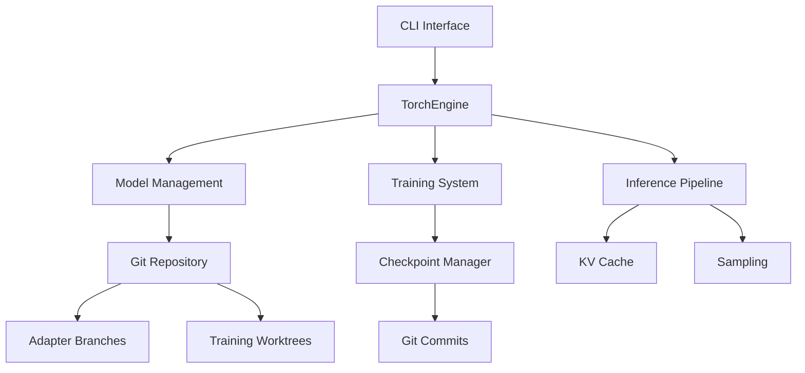

# HyprStream: LLM Inference Engine with Git-based Model Management

[](https://github.com/hyprstream/hyprstream/actions/workflows/rust.yml)
[](https://www.gnu.org/licenses/agpl-3.0)

## Overview

HyprStream is a production-ready LLM inference engine built in Rust with PyTorch, featuring integrated training capabilities and Git-based model version control. It provides a unified platform for model inference, fine-tuning through LoRA adapters, and comprehensive model lifecycle management.

### Core Features

- **High-Performance Inference**: PyTorch-based engine with KV caching and optimized memory management
- **LoRA Training & Adaptation**: Create, train, and deploy LoRA adapters for model customization
- **Git-based Model Management**: Version control for models and adapters using Git workflows
- **Multi-Model Support**: Compatible with Qwen, Llama, Gemma, and other popular architectures
- **Training Checkpoints**: Automatic checkpoint management with Git integration
- **Production Ready**: Built on stable PyTorch C++ API (libtorch) for reliability

## Installation

### Prerequisites

- Rust 1.75+
- Git 2.0+
- libtorch (automatically downloaded or use existing installation)
- CUDA 12.x (optional, for GPU acceleration)
- 8GB+ RAM for inference, 16GB+ for training

### Building from Source

```bash
# Clone repository
git clone https://github.com/hyprstream/hyprstream-torch.git
cd hyprstream-torch

# Set libtorch path (if using existing installation)
export LIBTORCH=/path/to/libtorch
export LD_LIBRARY_PATH=$LIBTORCH/lib:$LD_LIBRARY_PATH

# Build with CUDA support (optional)
cargo build --release --features cuda

# The binary will be at ./target/release/hyprstream
```

## Quick Start

### Model Management

```bash
# Download a model from HuggingFace
hyprstream model pull Qwen/Qwen2.5-3B-Instruct

# List available models
hyprstream model list

# Show model information
hyprstream model info Qwen2.5-3B-Instruct

# Import a local model
hyprstream model import ./path/to/model --name my-custom-model
```

### Running Inference

```bash
# Basic inference
hyprstream infer Qwen2.5-3B-Instruct \
    --prompt "Explain quantum computing in simple terms"

# With generation parameters
hyprstream infer Qwen2.5-3B-Instruct \
    --prompt "Write a Python function to sort a list" \
    --temperature 0.7 \
    --top-p 0.9 \
    --max-tokens 256
```

### LoRA Adapter Training

```bash
# Create a new LoRA adapter
hyprstream lora create \
    --name my-adapter \
    --base-model Qwen2.5-3B-Instruct \
    --rank 16 \
    --alpha 32

# Start training with samples
hyprstream lora train start my-adapter \
    --learning-rate 1e-4 \
    --batch-size 8

# Add training samples
hyprstream lora train sample my-adapter \
    --input "What is machine learning?" \
    --output "Machine learning is a subset of AI..."

# Monitor training status
hyprstream lora train status my-adapter

# Export trained adapter
hyprstream lora export my-adapter \
    --output ./my-adapter.safetensors
```

### Git-based Version Control

HyprStream uses Git for comprehensive model and adapter versioning:

```bash
# Models are stored as Git repositories
cd ~/.cache/hyprstream/models/Qwen2.5-3B-Instruct
git log  # View model history

# Each adapter is a Git branch
git branch
# Output:
# * main
#   adapter/uuid-1234  # my-adapter
#   adapter/uuid-5678  # another-adapter

# Adapters train in isolated worktrees
ls ~/.cache/hyprstream/models/working/
# uuid-1234/  # Active training environment for my-adapter

# Training checkpoints are automatically committed
git log --oneline adapter/uuid-1234
# abc123 Checkpoint at step 10000
# def456 Checkpoint at step 5000
# ghi789 Initial adapter configuration
```

## Architecture

### System Components



### Key Design Decisions

1. **Git-based Storage**: Models and adapters are Git repositories, enabling:
   - Version control and rollback
   - Efficient storage through Git's deduplication
   - Distributed model sharing
   - Atomic checkpoint commits

2. **Branch-based Adapters**: Each LoRA adapter is a Git branch:
   - UUID-based branch names for stability
   - Human-friendly tags for usability
   - Isolated training in worktrees
   - Parallel adapter development

3. **Checkpoint Management**: Training progress is tracked through Git:
   - Automatic commits at intervals
   - Milestone tagging
   - Training metrics in commit messages
   - Easy rollback to previous states

## Supported Models

| Architecture | Status | Models |
|-------------|--------|--------|
| Qwen | ✅ Full Support | Qwen2, Qwen2.5 (0.5B to 72B) |
| Llama | ⚠️ Experimental | Llama2, Llama3 |
| Gemma | ⚠️ Experimental | Gemma 2B, 7B |
| Mistral | 🚧 In Development | Mistral 7B |

## API Usage

### REST API (Coming Soon)

```bash
# Start API server
hyprstream serve --port 8080

# Make inference request
curl -X POST http://localhost:8080/v1/completions \
  -H "Content-Type: application/json" \
  -d '{
    "model": "Qwen2.5-3B-Instruct",
    "prompt": "Hello, world!",
    "max_tokens": 100
  }'
```

### Python Client (Planned)

```python
from hyprstream import Client

client = Client("http://localhost:8080")
response = client.generate(
    model="Qwen2.5-3B-Instruct",
    prompt="Explain neural networks",
    temperature=0.7
)
```

## Performance

| Model | Hardware | Tokens/sec | Memory |
|-------|----------|------------|---------|
| Qwen2.5-3B | RTX 4090 | ~120 | 6GB |
| Qwen2.5-3B | CPU (16 cores) | ~15 | 8GB |
| Qwen2.5-7B | RTX 4090 | ~85 | 14GB |
| Qwen2.5-7B | A100 40GB | ~140 | 14GB |

## Development Status

### ✅ Completed
- PyTorch/libtorch integration
- SafeTensors model loading
- KV caching system
- Git-based model storage
- LoRA adapter creation
- Training checkpoint system
- CLI interface

### 🚧 In Progress
- REST API server
- Training data pipelines
- Dynamic batching
- Model quantization

### 📋 Planned
- WebSocket streaming
- Distributed inference
- Multi-GPU training
- RLHF support
- Model merging tools
- Web UI

## Contributing

We welcome contributions! Priority areas:

- API development (REST/gRPC)
- Training optimizations
- Model architecture support
- Documentation improvements
- Testing infrastructure

See [CONTRIBUTING.md](CONTRIBUTING.md) for guidelines.

## License

GNU Affero General Public License v3.0 - See [LICENSE](LICENSE) for details.

## Acknowledgments

Built with:
- [PyTorch](https://pytorch.org/) - Deep learning framework
- [tch](https://github.com/LaurentMazare/tch) - Rust bindings for PyTorch
- [SafeTensors](https://github.com/huggingface/safetensors) - Efficient tensor serialization
- [Git2](https://github.com/rust-lang/git2-rs) - Git operations in Rust
- [Tokio](https://tokio.rs/) - Async runtime
- [HuggingFace Hub](https://huggingface.co/) - Model repository