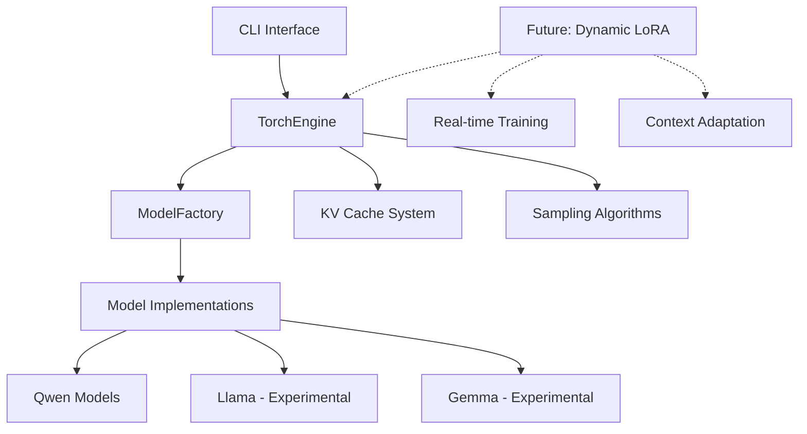

# HyprStream: ML Inference & Training Engine with Dynamic LoRA Adaptation

[](https://github.com/hyprstream/hyprstream/actions/workflows/rust.yml)
[](https://www.gnu.org/licenses/agpl-3.0)

## Overview

HyprStream is a PyTorch-based ML inference and training engine built in Rust, designed for real-time model adaptation through dynamic LoRA (Low-Rank Adaptation) layers. The system enables continuous learning during inference, allowing models to adapt to context and user patterns in real-time.

### Key Goals

- **Inference & Training**: Unified engine for both inference and training workflows
- **Dynamic LoRA Adaptation**: Real-time weight updates through LoRA layers during generation (planned)
- **Multi-Model Support**: Qwen models (Llama and Gemma experimental)
- **Production Ready**: Built on PyTorch's libtorch for stability and performance
- **KV Caching**: Optimized sequential generation with key-value caching

## Installation

### Prerequisites

- Rust 1.75+
- libtorch (automatically downloaded or use existing installation)
- 8GB+ RAM for running models

### Building from Source

```bash
# Clone repository
git clone https://github.com/hyprstream/hyprstream-torch.git
cd hyprstream-torch

# Set libtorch path (if using existing installation)
export LD_LIBRARY_PATH=$PWD/libtorch/lib:$LD_LIBRARY_PATH

# Build
cargo build --release

# The binary will be at ./target/release/hyprstream
```

## Usage

HyprStream provides a CLI for model operations:

### Download Models

```bash
# Download from HuggingFace
hyprstream pull Qwen/Qwen2.5-3B-Instruct
```

### Run Inference

```bash
# Run inference with a prompt
hyprstream infer ~/.cache/hyprstream/models/Qwen/Qwen2.5-3B-Instruct \
    --prompt "What is the capital of France?" \
    --max-tokens 100
```

### Model Information

```bash
# Show model details
hyprstream model info ~/.cache/hyprstream/models/Qwen/Qwen2.5-3B-Instruct
```

### Generation Parameters

Inference commands support these optional parameters:

- `--temperature <float>` - Sampling temperature (default: 0.7)
- `--top-p <float>` - Nucleus sampling threshold (default: 0.9)
- `--top-k <int>` - Top-k sampling (default: 50)
- `--repetition-penalty <float>` - Repetition penalty (default: 1.1)
- `--max-tokens <int>` - Maximum tokens to generate (default: 2048)
- `--seed <int>` - Random seed for reproducibility

## Supported Models

- **Qwen**: Full support for Qwen2/Qwen2.5 series
- **Llama**: Experimental support
- **Gemma**: Experimental support

Models are automatically detected based on their architecture and configuration.

## System Architecture



## Roadmap

### Current Features
- ✅ PyTorch/libtorch integration
- ✅ SafeTensors model loading
- ✅ KV caching for fast generation
- ✅ Qwen model support
- ✅ CLI interface
- ✅ Tokenizer integration

### In Development
- 🚧 REST/gRPC API layer
- 🚧 Dynamic batching
- 🚧 Model quantization

### Planned Features
- 📋 Dynamic LoRA adaptation during inference
- 📋 Real-time training from context
- 📋 Multi-adapter routing (X-LoRA)
- 📋 Continuous learning pipelines
- 📋 WebSocket streaming
- 📋 Distributed inference

## Contributing

We welcome contributions, especially in:
- Dynamic LoRA implementation
- API layer development
- Model architecture support
- Performance optimizations
- Documentation

## License

GNU Affero General Public License v3.0 - See [LICENSE](LICENSE) for details.

## Acknowledgments

Built with:
- [PyTorch](https://pytorch.org/) - Deep learning framework
- [tch](https://github.com/LaurentMazare/tch) - Rust bindings for PyTorch
- [SafeTensors](https://github.com/huggingface/safetensors) - Model format
- [HuggingFace](https://huggingface.co/) - Model hub
- [Tokio](https://tokio.rs/) - Async runtime