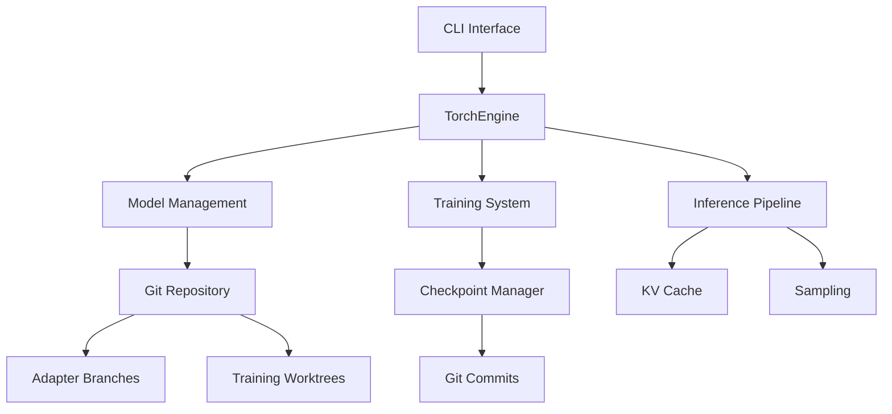

# HyprStream: LLM Inference Engine with Git-based Model Management

[](https://github.com/hyprstream/hyprstream/actions/workflows/rust.yml)
[](https://www.gnu.org/licenses/agpl-3.0)

## Overview

HyprStream is a production-ready LLM inference engine built in Rust with PyTorch, featuring integrated training capabilities and Git-based model version control. It provides a unified platform for model inference, fine-tuning through LoRA adapters, and comprehensive model lifecycle management.

### Core Features

- **High-Performance Inference**: PyTorch-based engine with KV caching and optimized memory management
- **Hardware Acceleration**: CPU and AMD GPU (ROCm) support, NVIDIA GPU (CUDA) coming soon
- **LoRA Training & Adaptation**: Create, train, and deploy LoRA adapters for model customization
- **Git-based Model Management**: Version control for models and adapters using Git workflows
- **Multi-Model Support**: Qwen models (Qwen1/2/3 dense architectures), MoE support coming soon
- **Training Checkpoints**: Automatic checkpoint management with Git integration
- **Production Ready**: Built on stable PyTorch C++ API (libtorch) for reliability

## Installation

### Prerequisites

- Rust 1.75+
- Git 2.0+
- libtorch (automatically downloaded or use existing installation)
- **Hardware Support:**
  - **CPU**: Full support (x86_64, ARM64)
  - **ROCm**: AMD GPU support (gfx90a, gfx1100+)
  - **CUDA**: Coming soon
- 8GB+ RAM for inference, 16GB+ for training

### Building from Source

```bash
# Clone repository
git clone https://github.com/hyprstream/hyprstream-torch.git
cd hyprstream-torch

# Set libtorch path (if using existing installation)
export LIBTORCH=/path/to/libtorch
export LD_LIBRARY_PATH=$LIBTORCH/lib:$LD_LIBRARY_PATH

# Build with ROCm support (for AMD GPUs) - Use the automated script
# MUST PROVIDE ROCm libtorch - tested with rocm 6.4
./build-rocm.sh release

# Or manually with environment variables
export LIBTORCH=/path/to/rocm-libtorch
cargo build --release

# The binary will be at ./target/release/hyprstream
```

## Quick Start

### Model Management

#### Downloading Models

```bash
# Clone a model from Git repository (HuggingFace, GitHub, etc.)
hyprstream model clone https://huggingface.co/Qwen/Qwen3-0.6B

# Clone a specific branch or tag
hyprstream model clone https://huggingface.co/Qwen/Qwen3-8B --git-ref main

# List available models (shows UUID and names)
hyprstream model list

# Show model information (use UUID from list)
hyprstream model info <model-uuid>

# Import a shared model from Git
hyprstream model import https://github.com/user/custom-model.git --name my-custom-model
```

#### Managing Models

```bash
# List all cached models with UUIDs
hyprstream model list

# Get detailed model information
hyprstream model info <model-uuid>

# Remove a model (requires UUID)
hyprstream model remove <model-uuid>

# Share a model with others
hyprstream model share <model-name> --push-to <git-remote-url>
```

### Running Inference

```bash
# Basic inference (use model UUID or name from list)
hyprstream model infer <model-uuid> \
    --prompt "Explain quantum computing in simple terms"

# With generation parameters
hyprstream model infer <model-uuid> \
    --prompt "Write a Python function to sort a list" \
    --temperature 0.7 \
    --top-p 0.9 \
    --max-tokens 1024
```

### LoRA Adapter Training

Status: Experimental

```bash
# Create a new LoRA adapter (use model UUID from list)
hyprstream lora create \
    --name my-adapter \
    --base-model <model-uuid> \
    --rank 16 \
    --alpha 32

# Start training with samples
hyprstream lora train start my-adapter \
    --learning-rate 1e-4 \
    --batch-size 8

# Add training samples
hyprstream lora train sample my-adapter \
    --input "What is machine learning?" \
    --output "Machine learning is a subset of AI..."

# Monitor training status
hyprstream lora train status my-adapter

# Export trained adapter
hyprstream lora export my-adapter \
    --output ./my-adapter.safetensors
```

### Git-based Version Control

HyprStream uses Git for comprehensive model and adapter versioning:

```bash
# Models are stored as Git repositories with UUID-based directories
cd ~/.cache/hyprstream/models/<model-uuid>
git log  # View model history

# Each adapter is a Git branch with UUID-based naming
git branch
# Output:
# * main
#   adapter/uuid-1234  # my-adapter
#   adapter/uuid-5678  # another-adapter

# Adapters train in isolated worktrees
ls ~/.cache/hyprstream/models/working/
# uuid-1234/  # Active training environment for my-adapter

# Training checkpoints are automatically committed
git log --oneline adapter/uuid-1234
# abc123 Checkpoint at step 10000
# def456 Checkpoint at step 5000
# ghi789 Initial adapter configuration
```

## Architecture

### System Components



### Key Design Decisions

1. **Git-based Storage**: Models and adapters are Git repositories, enabling:
   - Version control and rollback
   - Efficient storage through Git's deduplication
   - Distributed model sharing
   - Atomic checkpoint commits

2. **Branch-based Adapters**: Each LoRA adapter is a Git branch:
   - UUID-based branch names for stability
   - Human-friendly tags for usability
   - Isolated training in worktrees
   - Parallel adapter development

3. **Checkpoint Management**: Training progress is tracked through Git:
   - Automatic commits at intervals
   - Milestone tagging
   - Training metrics in commit messages
   - Easy rollback to previous states

## Supported Models

| Architecture | Status | Models |
|-------------|--------|--------|
| Qwen Dense | ✅ Full Support | Qwen1, Qwen2, Qwen2.5, Qwen3 |
| Qwen MoE | 🚧 Coming Soon | Qwen2-MoE, Qwen2.5-MoE |
| Llama | 🚧 Planned | Llama2, Llama3 |
| Gemma | 🚧 Planned | Gemma 2B, 7B |
| Mistral | 🚧 Planned | Mistral 7B |

## API Usage

### OpenAI-Compatible REST API

HyprStream provides an OpenAI-compatible API endpoint for easy integration with existing tools and libraries:

```bash
# Start API server
hyprstream serve --port 8080

# Make chat completions request (OpenAI-compatible)
curl -X POST http://localhost:8080/oai/v1/chat/completions \
  -H "Content-Type: application/json" \
  -d '{
    "model": "<model-uuid>",
    "messages": [
      {"role": "user", "content": "Hello, world!"}
    ],
    "max_tokens": 100,
    "temperature": 0.7
  }'

# Or use with any OpenAI-compatible client
export OPENAI_API_KEY="dummy"
export OPENAI_BASE_URL="http://localhost:8080/oai/v1"
# Now use any OpenAI client library
```

### Environment Configuration

HyprStream can be configured via environment variables with the `HYPRSTREAM_` prefix:

```bash
# Server configuration
export HYPRSTREAM_SERVER_HOST=0.0.0.0
export HYPRSTREAM_SERVER_PORT=8080
export HYPRSTREAM_API_KEY=your-api-key

# CORS settings
export HYPRSTREAM_CORS_ENABLED=true
export HYPRSTREAM_CORS_ORIGINS="*"

# Model management
export HYPRSTREAM_PRELOAD_MODELS=model1,model2,model3
export HYPRSTREAM_MAX_CACHED_MODELS=5
export HYPRSTREAM_MODELS_DIR=/custom/models/path

# ROCm/HIP for AMD GPUs
export ROCM_PATH=/usr
export PYTORCH_ROCM_ARCH=gfx90a
export LIBTORCH=./libtorch
export LD_LIBRARY_PATH=./libtorch/lib:$LD_LIBRARY_PATH

# Performance tuning
export HYPRSTREAM_USE_MMAP=true
export HYPRSTREAM_GENERATION_TIMEOUT=120
```

## Contributing

See [CONTRIBUTING.md](CONTRIBUTING.md) for guidelines.

## License

GNU Affero General Public License v3.0 - See [LICENSE](LICENSE) for details.

## Acknowledgments

Built with:
- [PyTorch](https://pytorch.org/) - Deep learning framework
- [tch](https://github.com/LaurentMazare/tch) - Rust bindings for PyTorch
- [SafeTensors](https://github.com/huggingface/safetensors) - Efficient tensor serialization
- [Git2](https://github.com/rust-lang/git2-rs) - Git operations in Rust
- [Tokio](https://tokio.rs/) - Async runtime
