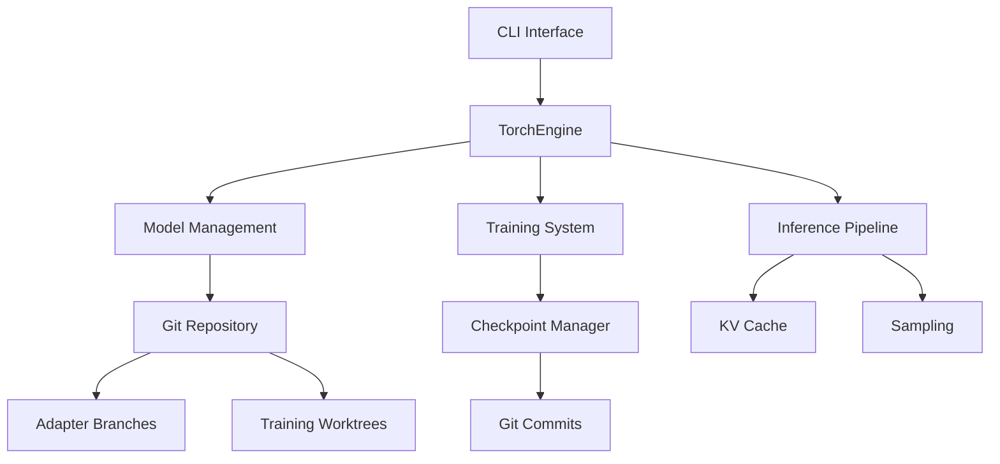

# HyprStream: LLM Inference Engine with Git-based Model Management

[](https://github.com/hyprstream/hyprstream/actions/workflows/rust.yml)
[](https://www.gnu.org/licenses/agpl-3.0)

## Overview

HyprStream is a LLM inference and training engine built in Rust with PyTorch, featuring integrated training capabilities and Git-based model version control. It provides a unified platform for model inference, fine-tuning through LoRA adapters, and comprehensive model lifecycle management.

### Core Features

- **Inference API**: Providing compatibility with OpenAI's OpenAPI specification.
- **Management API**: Providing management APIs (WIP)
- **High-Performance Inference**: PyTorch-based engine with KV caching and optimized memory management
- **Hardware Acceleration**: CPU (default), NVIDIA GPU (CUDA), and AMD GPU (ROCm) support
- **LoRA Training & Adaptation**: Create, train, and deploy LoRA adapters for model customization
- **Git-based Model Management**: Version control for models using native Git repositories
- **Hugging Face Compatible**: Direct cloning and usage of models from Hugging Face Hub
- **Efficient Storage**: XET integration for lazy loading and deduplication of large model files
- **Multi-Model Support**: Qwen models (Qwen1/2/3 dense architectures), MoE support coming soon
- **Training Checkpoints**: Automatic checkpoint management with Git integration
- **Production Ready**: Built on stable PyTorch C++ API (libtorch) for reliability

## Installation

### Prerequisites

- **Operating System**: Linux (x86_64, ARM64)
  - Windows users: Use WSL2 (Windows Subsystem for Linux)
  - macOS: Not currently supported
- Rust 1.75+
- Git 2.0+
- libtorch (PyTorch C++ library)
- **Hardware Support:**
  - **CPU**: Full support (x86_64, ARM64)
  - **CUDA**: NVIDIA GPU support
  - **ROCm**: AMD GPU support (gfx90a, gfx1100+)
- 8GB+ RAM for inference, 16GB+ for training

### PyTorch Backend Selection

Hyprstream uses feature flags to select the PyTorch backend:

- **`tch-cpu`** (default): CPU-only inference
- **`tch-cuda`**: NVIDIA GPU acceleration via CUDA
- **`tch-rocm`**: AMD GPU acceleration via ROCm/HIP

### Run with Docker:

1. Pull model(s):

```
$ sudo docker --rm -it -v hyprstream-models:/root/.local/share/hyprstream hyprstream:dev clone https://huggingface.co/qwen/qwen3-0.6b
```

2. Test inference and GPU initialization

```
$ sudo docker --rm -it -v hyprstream-models:/root/.local/share/hyprstream hyprstream:dev infer --prompt "hello world" qwen3-0.6b
```


3. Deploy openai compatible server:

```
$ sudo docker --rm -it -v hyprstream-models:/root/.local/share/hyprstream h --device=/dev/kfd --device=/dev/dri hyprstream:dev
```

Interactive shell:

```
$ sudo docker --rm -it --device=/dev/kfd --device=/dev/dri --entrypoint=bash hyprstream:dev
$ hyprstream clone https://huggingface.co/qwen/qwen3-0.6b
$ hyprstream infer --prompt "hello world" --max-tokens 1024 qwen3-0.6b
```

### Building Docker images

#### ROCm:

$ docker build -t hyprstream:dev-rocm --build-arg variant=rocm .

#### Nvidia:

$ docker build -t hyprstream:dev-cuda --build-arg variant=cuda .

#### CPU:

$ docker build -t hyprstream:dev-cpu .

### Building from Source

#### 1. Clone Repository

```bash
git clone https://github.com/hyprstream/hyprstream.git
cd hyprstream
```

#### 2. Install libtorch

You have three options for obtaining libtorch:

**Option A: Automatic Download (Recommended)**
```bash
# tch-rs will automatically download libtorch during build
# CPU version is downloaded by default
cargo build --release
```

**Option B: Download from PyTorch**
```bash
# CUDA 12.9 version
wget https://download.pytorch.org/libtorch/cu129/libtorch-cxx11-abi-shared-with-deps-2.8.0%2Bcu129.zip
unzip libtorch-cxx11-abi-shared-with-deps-2.8.0+cu129.zip

# CUDA 13.0 Nightly
wget https://download.pytorch.org/libtorch/nightly/cu130/libtorch-shared-with-deps-latest.zip
unzip libtorch-shared-with-deps-latest.zip

# ROCm 7.0 Nightly
wget https://download.pytorch.org/libtorch/nightly/rocm7.0/libtorch-shared-with-deps-latest.zip
unzip libtorch-shared-with-deps-latest.zip
```

**Option C: Use Existing PyTorch Installation**
```bash
# If you have PyTorch installed via pip/conda
export LIBTORCH_USE_PYTORCH=1
```

#### 3. Set Environment Variables

Configure libtorch location:

```bash
# Option 1: Set LIBTORCH to the directory containing 'lib' and 'include'
export LIBTORCH=/path/to/libtorch

# Option 2: Set individual paths
export LIBTORCH_INCLUDE=/path/to/libtorch
export LIBTORCH_LIB=/path/to/libtorch

# Option 3: Use system-wide installation
# libtorch installed at /usr/lib/libtorch.so is detected automatically

# Add to library path
export LD_LIBRARY_PATH=$LIBTORCH/lib:$LD_LIBRARY_PATH
```

#### 4. Build with Backend Selection

**CPU Backend (Default)**
```bash
# Automatic download
cargo build --release

# Or with manual libtorch
export LIBTORCH=/path/to/libtorch-cpu
export LD_LIBRARY_PATH=$LIBTORCH/lib:$LD_LIBRARY_PATH
cargo build --release
```

**CUDA Backend**
```bash
# Set CUDA version for automatic download
export TORCH_CUDA_VERSION=cu118  # or cu121, cu124
cargo build --release --no-default-features --features tch-cuda

# Or with manual CUDA libtorch
export LIBTORCH=/path/to/libtorch-cuda
export LD_LIBRARY_PATH=$LIBTORCH/lib:$LD_LIBRARY_PATH
cargo build --release --no-default-features --features tch-cuda
```

**ROCm Backend (AMD GPUs)**
```bash
# Download ROCm libtorch (must be done manually)
# Visit: https://pytorch.org/get-started/locally/
# Select: Linux > Libtorch > C++/Java > ROCm

# ROCm 7.0 Nightly
wget https://download.pytorch.org/libtorch/nightly/rocm7.0/libtorch-shared-with-deps-latest.zip
unzip libtorch-shared-with-deps-latest.zip

# Set environment variables
export ROCM_PATH=/opt/rocm
export LIBTORCH=/path/to/libtorch-rocm
export LD_LIBRARY_PATH=$LIBTORCH/lib:$LD_LIBRARY_PATH
export PYTORCH_ROCM_ARCH=gfx90a  # or gfx1100, gfx1101, etc.

# Build with ROCm feature
cargo build --release --no-default-features --features tch-rocm

# Alternative: Use the automated script (tested with ROCm 6.4 & ROCm 7.0 nightly)
./build-rocm.sh release
```

#### 5. Run

```bash
# The binary will be at ./target/release/hyprstream
./target/release/hyprstream --help
```

### Additional Build Options

**Static Linking**
```bash
export LIBTORCH_STATIC=1
cargo build --release
```

**Combining Features**
```bash
# CUDA + OpenTelemetry
cargo build --release --no-default-features --features tch-cuda,otel

# ROCm + GitTorrent P2P transport
cargo build --release --no-default-features --features tch-rocm,gittorrent
```

## Quick Start

### Model Management

#### Downloading Models

```bash
# Clone a model from Git repository (HuggingFace, GitHub, etc.)
hyprstream clone https://huggingface.co/Qwen/Qwen3-0.6B

# Clone with a custom name
hyprstream clone https://huggingface.co/Qwen/Qwen3-0.6B --name qwen3-small

# Import a shared model from Git
hyprstream clone https://github.com/user/custom-model.git --name my-custom-model
```

#### Managing Models

```bash
# List all cached models (shows names and UUIDs)
hyprstream list

# Get detailed model information using ModelRef syntax
# Note that git-ref branch and tag management is a work in progress.
# Simple 'by name' models are verified.
hyprstream inspect qwen3-small           # By name
hyprstream inspect qwen3-small:main      # Specific branch
hyprstream inspect qwen3-small:v1.0      # Specific tag
hyprstream inspect qwen3-small:abc123    # Specific commit

# Pull latest updates for a model
hyprstream pull qwen3-small           # Update to latest
hyprstream pull qwen3-small main      # Update specific branch

# Push changes to remote
hyprstream push qwen3-small origin main
```

### Running Inference

```bash
# Basic inference using ModelRef syntax
hyprstream infer qwen3-small \
    --prompt "Explain quantum computing in simple terms"

# Inference with specific model version
hyprstream infer qwen3-small:v1.0 \
    --prompt "Explain quantum computing"

# Inference with specific branch
hyprstream infer qwen3-small:main \
    --prompt "Write a Python function to sort a list" \
    --temperature 0.7 \
    --top-p 0.9 \
    --max-tokens 1024
```

### LoRA Adapter Training

Status: Experimental

HyprStream provides LoRA (Low-Rank Adaptation) training via the `lt` command, with full git integration for version control:

```bash
# Create and train a LoRA adapter
hyprstream lt qwen3-small \
    --adapter coding_assistant \
    --rank 16 \
    --learning-rate 1e-4 \
    --batch-size 4 \
    --epochs 10

# Interactive training mode (learns from conversations)
hyprstream lt qwen3-small \
    --adapter interactive_tutor \
    --interactive

# Training with custom data file (JSONL format)
hyprstream lt qwen3-small \
    --adapter domain_expert \
    --data training_samples.jsonl \
    --rank 32 \
    --epochs 5

# Use existing training configuration
hyprstream lt qwen3-small \
    --adapter advanced_model \
    --config training_config.json
```

#### Git Integration for LoRA Training

LoRA adapters are automatically managed with git:

```bash
# Check training status and git state
hyprstream status qwen3-small

# Commit trained adapter to git
hyprstream commit qwen3-small -m "Add coding assistant adapter"

# Create branches for different training experiments
hyprstream branch qwen3-small experiment-1
hyprstream checkout qwen3-small:experiment-1

# Train on the experimental branch
hyprstream lt qwen3-small:experiment-1 --adapter test_model
```

#### Training Data Format

Training data should be in JSONL format:
```json
{"input": "What is machine learning?", "output": "Machine learning is a subset of AI that enables computers to learn from data."}
{"input": "Explain neural networks", "output": "Neural networks are computational models inspired by biological neural networks."}
```

## Architecture

### System Components



### Key Design Decisions

1. **Git-based Storage**: Models are stored as native Git repositories:
   - Full version control and rollback
   - Efficient large file handling via XET
   - Compatible with Hugging Face Hub
   - Seamless model sharing

2. **Branch-based Adapters**: Each LoRA adapter is a Git branch:
   - UUID-based branch names for stability
   - Human-friendly tags for usability
   - Isolated training in worktrees
   - Parallel adapter development

3. **Checkpoint Management**: Training progress is tracked through Git:
   - Automatic commits at intervals
   - Milestone tagging
   - Training metrics in commit messages
   - Easy rollback to previous states

## Model References (ModelRef)

HyprStream uses a flexible ModelRef syntax for referencing models and their versions:

- **`model-name`** - Reference model by name (uses registry's pinned commit)
- **`model-name:branch`** - Reference specific branch (e.g., `qwen3:main`)
- **`model-name:tag`** - Reference specific tag/version (e.g., `qwen3:v1.0`)
- **`model-name:commit`** - Reference specific commit (e.g., `qwen3:abc123`)

Examples:
```bash
# Use the default version
hyprstream infer llama3 --prompt "Hello"

# Use a specific branch
hyprstream infer llama3:experimental --prompt "Hello"

# Use a specific release tag
hyprstream infer llama3:v2.0 --prompt "Hello"

# Use a specific commit for reproducibility
hyprstream infer llama3:f3a8b92 --prompt "Hello"
```

## Supported Models

| Architecture | Status | Models |
|-------------|--------|--------|
| Qwen Dense | ✅ Full Support | Qwen1, Qwen2, Qwen2.5, Qwen3 |
| Qwen MoE | 🚧 Coming Soon | Qwen2-MoE, Qwen2.5-MoE |
| Llama | 🚧 Planned | Llama2, Llama3 |
| Gemma | 🚧 Planned | Gemma 2B, 7B |
| Mistral | 🚧 Planned | Mistral 7B |

## API Usage

### OpenAI-Compatible REST API

HyprStream provides an OpenAI-compatible API endpoint for easy integration with existing tools and libraries:

```bash
# Start API server
hyprstream serve --port 8080

# Make chat completions request (OpenAI-compatible)
curl -X POST http://localhost:8080/oai/v1/chat/completions \
  -H "Content-Type: application/json" \
  -d '{
    "model": "qwen3-small",
    "messages": [
      {"role": "user", "content": "Hello, world!"}
    ],
    "max_tokens": 100,
    "temperature": 0.7
  }'

# Or use with any OpenAI-compatible client
export OPENAI_API_KEY="dummy"
export OPENAI_BASE_URL="http://localhost:8080/oai/v1"
# Now use any OpenAI client library
```

### Environment Configuration

HyprStream can be configured via environment variables with the `HYPRSTREAM_` prefix:

```bash
# Server configuration
export HYPRSTREAM_SERVER_HOST=0.0.0.0
export HYPRSTREAM_SERVER_PORT=8080
export HYPRSTREAM_API_KEY=your-api-key

# CORS settings
export HYPRSTREAM_CORS_ENABLED=true
export HYPRSTREAM_CORS_ORIGINS="*"

# Model management
export HYPRSTREAM_PRELOAD_MODELS=model1,model2,model3
export HYPRSTREAM_MAX_CACHED_MODELS=5
export HYPRSTREAM_MODELS_DIR=/custom/models/path

# Performance tuning
export HYPRSTREAM_USE_MMAP=true
export HYPRSTREAM_GENERATION_TIMEOUT=120
```

### Runtime Configuration for GPU Backends

**For CUDA builds:**
```bash
# Ensure CUDA libraries are in path
export LD_LIBRARY_PATH=$LIBTORCH/lib:$LD_LIBRARY_PATH

# Optional: Specify GPU device
export CUDA_VISIBLE_DEVICES=0,1
```

**For ROCm builds:**
```bash
# ROCm/HIP configuration
export ROCM_PATH=/opt/rocm
export PYTORCH_ROCM_ARCH=gfx90a  # or your GPU architecture
export LIBTORCH=/path/to/libtorch-rocm
export LD_LIBRARY_PATH=$LIBTORCH/lib:$ROCM_PATH/lib:$LD_LIBRARY_PATH

# Optional: Specify GPU device
export HIP_VISIBLE_DEVICES=0,1
```

## Contributing

See [CONTRIBUTING.md](CONTRIBUTING.md) for guidelines.

## License

GNU Affero General Public License v3.0 - See [LICENSE](LICENSE) for details.

## Acknowledgments

Built with:
- [PyTorch](https://pytorch.org/) - Deep learning framework
- [tch](https://github.com/LaurentMazare/tch) - Rust bindings for PyTorch
- [SafeTensors](https://github.com/huggingface/safetensors) - Efficient tensor serialization
- [Git2](https://github.com/rust-lang/git2-rs) - Git operations in Rust
- [Tokio](https://tokio.rs/) - Async runtime
