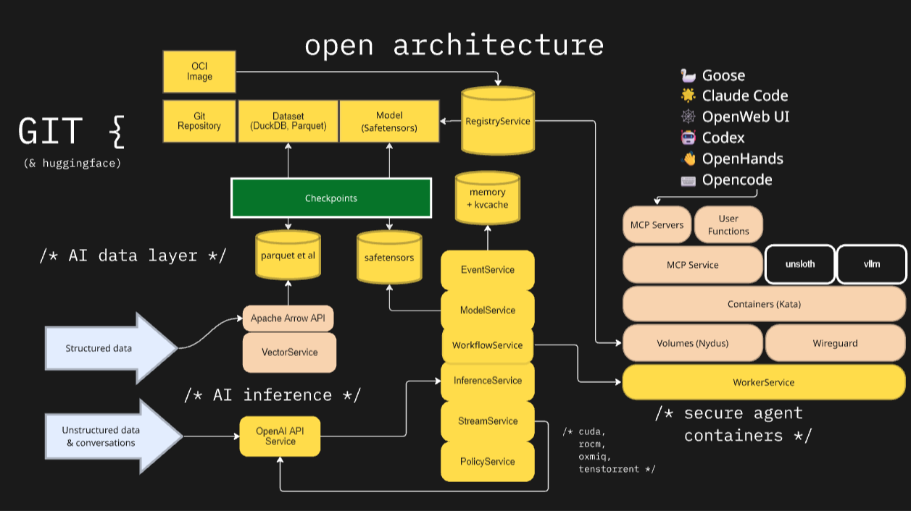

# HyprStream: agentic infrastructure for continously learning applications

[](https://github.com/hyprstream/hyprstream/actions/workflows/rust.yml)
[](LICENSE-AGPLV3)
[](LICENSE-MIT)

## Overview

HyprStream is an agentic cloud infrastructure for applications that learn, build, and run. Integrating continous development, training, integration, and deployment of software and AI/ML models. Primary features include an LLM inference and training engine built in Rust, with PyTorch, featuring integrated training capabilities, version control, and secure tool use with microvm containers.

Users may communicate with open weight and custom LLMs via Hyprstream with an OpenAI API.

Easy to get started, just down [Download](https://github.com/hyprstream/hyprstream/releases/tag/v0.2.0) and it auto-detects your NVIDIA or ROCm GPU.

### Core Features

- **Inference API**: Providing compatibility with OpenAI's OpenAPI specification.
- **LLM Inference & Training**: Supporting the dense Qwen3 model architecture.
- **Optional Hardware Acceleration**: Auto-detects your optional NVIDIA or AMD GPU, and packages the appropriate Torch dependencies.
- **Version Controlled**: Manages source and weights with Git, compatible with HuggingFace.
- **Systemd Integration** - Optional user-level service management for background workers, long-running services, and containers.
- **Production Ready**: Built on stable PyTorch C++ API (libtorch) for reliability

### Experimental Features

- **[Workers](docs/workers-architecture.md)** - Isolated workload execution using Kata microvms with cloud-hypervisor.
- **[Workflows]** - Git workflow file support for local continous integration, deployment, and functions-as-a-service.

## Installation

### Quick Install (AppImage)

Download the Universal AppImage from the [v0.2.0 release](https://github.com/hyprstream/hyprstream/releases/tag/v0.2.0). We have published AppImages for each supported CPU and GPU configuration. Hyprstream requires the `git-lfs` package, which is available in all major distros.

```bash
# Download and install (Universal recommended)
chmod +x hyprstream-v0.2.0-x86_64.AppImage
./hyprstream-v0.2.0-x86_64.AppImage service install

# Apply policy template - hyprstream is deny by default, the following treats local users as admins:
hyprstream policy apply-template local
```

For CUDA systems, make sure you have installed [CUDA Toolkit](https://developer.nvidia.com/cuda/toolkit) and set `LD_PRELOAD`:

```bash
systemctl --user set-environment LD_PRELOAD=libtorch_cuda.so && systemctl --user restart hyprstream-model
```

The installed files will be located in `$HOME/.local/hyprstream/` and `$HOME/.local/bin/`.

### Expert installation: Linux Container Engines

Hyprstream is able to run and manage secure containers independently, and can run inside of containers. _A container engine is optional with Hyprstream_, but may be useful for deployment to Enterprise systems based on Docker or Kubernetes.

See [README-Docker.md](README-Docker.md) for more information on running in containers.

#### Building from source

```bash
# Set LIBTORCH= to your libtorch libraries, or set `--feature download-libtorch`
cargo build --release
```

See [DEVELOP.md](DEVELOP.md) for more information on building from source.

## Quick Start

### Clone a model

Hyprstream supports Qwen3 model inference from Git repositories.

Users may also manage standard source code repositories and datasets.

```bash
# Clone a model from Git repository (HuggingFace, GitHub, etc.)
hyprstream clone https://huggingface.co/Qwen/Qwen3-0.6B

# Clone with a custom name
hyprstream clone https://huggingface.co/Qwen/Qwen3-0.6B --name qwen3-small
```

### Managing Repositories

Worktrees are automatically managed by hyprstream, allowing efficient operations on multiple branches.

```bash
# List all cached models (shows names and UUIDs)
hyprstream list

# Get detailed model information using Model:Ref syntax
hyprstream inspect qwen3-small           # By name
hyprstream inspect qwen3-small:main      # Specific branch
hyprstream inspect qwen3-small:v1.0      # Specific tag
hyprstream inspect qwen3-small:abc123    # Specific commit

# Pull latest updates for a model
hyprstream pull qwen3-small           # Update to latest
hyprstream pull qwen3-small main      # Update specific branch

# Push changes to remote
hyprstream push qwen3-small origin main
```

### Run Inference

```bash
# Basic inference using ModelRef syntax
hyprstream infer qwen3-small \
    --prompt "Explain quantum computing in simple terms"

# Inference with specific model version
hyprstream infer qwen3-small:v1.0 \
    --prompt "Explain quantum computing"

# Inference with specific branch
hyprstream infer qwen3-small:main \
    --prompt "Write a Python function to sort a list" \
    --temperature 0.7 \
    --top-p 0.9 \
    --max-tokens 1024
```

## Architecture



## Integrating Hyprstream into your business or workflow

### OpenAI-Compatible REST API

HyprStream provides an OpenAI-compatible API endpoint for easy integration with existing tools and libraries:

```bash
# Start API server
hyprstream server --port 50051

# List available models (worktree-based)
curl http://localhost:50051/oai/v1/models

# Example response shows models as model:branch format
# {
#   "object": "list",
#   "data": [
#     {
#       "id": "qwen3-small:main",
#       "object": "model",
#       "created": 1762974327,
#       "owned_by": "system driver:overlay2, saved:2.3GB, age:2h cached"
#     },
#     {
#       "id": "qwen3-small:experiment-1",
#       "object": "model",
#       "created": 1762975000,
#       "owned_by": "system driver:overlay2, saved:1.8GB, age:30m"
#     }
#   ]
# }

# Make chat completions request (OpenAI-compatible)
# NOTE: Models must be referenced with branch (model:branch format)
curl -X POST http://localhost:50051/oai/v1/chat/completions \
  -H "Content-Type: application/json" \
  -d '{
    "model": "qwen3-small:main",
    "messages": [
      {"role": "user", "content": "Hello, world!"}
    ],
    "max_tokens": 100,
    "temperature": 0.7
  }'

# Or use with any OpenAI-compatible client
export OPENAI_API_KEY="dummy"
export OPENAI_BASE_URL="http://localhost:50051/oai/v1"
# Now use any OpenAI client library
# Note: Specify model as "qwen3-small:main" not just "qwen3-small"
```

#### Worktree-Based Model References

HyprStream uses Git worktrees for model management. The `/v1/models` endpoint lists **all worktrees** (not base models):

- **Format**: Models are always shown as `model:branch` (e.g., `qwen3-small:main`)
- **Multiple Versions**: Each worktree (branch) appears as a separate model
- **Metadata**: The `owned_by` field includes worktree metadata:
  - Storage driver (e.g., `driver:overlay2`)
  - Space saved via CoW (e.g., `saved:2.3GB`)
  - Worktree age (e.g., `age:2h`)
  - Cache status (`cached` if loaded in memory)

**Example**: If you have a model `qwen3-small` with branches `main`, `experiment-1`, and `training`, the API will list three separate entries:
- `qwen3-small:main`
- `qwen3-small:experiment-1`
- `qwen3-small:training`

This allows you to work with multiple versions of the same model simultaneously, each in its own worktree with isolated changes.

### Advanced deployments

HyprStream can be configured via environment variables with the `HYPRSTREAM_` prefix:

```bash
# Server configuration
export HYPRSTREAM_SERVER_HOST=0.0.0.0
export HYPRSTREAM_SERVER_PORT=8080
export HYPRSTREAM_API_KEY=your-api-key

# CORS settings
export HYPRSTREAM_CORS_ENABLED=true
export HYPRSTREAM_CORS_ORIGINS="*"

# Model management
export HYPRSTREAM_PRELOAD_MODELS=model1,model2,model3
export HYPRSTREAM_MAX_CACHED_MODELS=5
export HYPRSTREAM_MODELS_DIR=/custom/models/path

# Performance tuning
export HYPRSTREAM_USE_MMAP=true
export HYPRSTREAM_GENERATION_TIMEOUT=120
```

## Security & Authentication

Hyprstream implements layered security-in-depth:

### Security Layers

| Layer | Technology | Purpose |
|-------|------------|---------|
| **Transport** | CURVE encryption (TCP) | End-to-end encryption for TCP connections |
| **Application** | Ed25519 signed envelopes | Request authentication and integrity |
| **Authorization** | Casbin policy engine | RBAC/ABAC access control |
| **Isolation** | Kata Containers (optional) | VM-level workload isolation for workers |

### RPC Architecture

All inter-service communication uses ZeroMQ with Cap'n Proto serialization:

- **REQ/REP**: Synchronous RPC calls (policy checks, model queries)
- **PUB/SUB**: Event streaming (sandbox lifecycle, training progress)
- **XPUB/XSUB**: Steerable proxy for event distribution

Every request is wrapped in a `SignedEnvelope`:
- Ed25519 signature over the request payload
- Nonce for replay protection
- Timestamp for clock skew validation
- Request identity (Local user, API token, Peer, or Anonymous)

### Service Spawning

Services can run in multiple modes:
- **Tokio task**: In-process async execution
- **Dedicated thread**: For `!Send` types (e.g., tch-rs tensors)
- **Subprocess**: Isolated process with systemd or standalone backend

See [docs/rpc-architecture.md](docs/rpc-architecture.md) for detailed RPC infrastructure documentation.

## Policy Engine

**Quick Start:**
```bash
# View current policy
hyprstream policy show

# Check if a user has permission
hyprstream policy check alice model:qwen3-small infer

# Create an API token
hyprstream policy token create \
  --user alice \
  --name "dev-token" \
  --expires 30d \
  --scope "model:*"

# Apply a built-in template -- allow all local users access to all actions on all resources
hyprstream policy apply-template local
```

**Built-in Templates:**
- `local` - Full access for local users (default)
- `public-inference` - Anonymous inference access
- `public-read` - Anonymous read-only registry access

**Worker Resources** (experimental):
| Resource | Description |
|----------|-------------|
| `sandbox:*`, `sandbox:{id}` | Pod sandbox (Kata VM) operations |
| `container:*`, `container:{id}` | Container lifecycle within sandboxes |
| `image:*`, `image:{name}` | Image pull/push/list operations |
| `workflow:*`, `workflow:{path}` | Workflow execution (.github/workflows/*.yml) |
| `tool:*`, `tool:{name}` | MCP tool access (tool:bash, tool:read_file) |

**Policy History & Rollback:**
```bash
# View policy commit history
hyprstream policy history

# Compare draft vs running policy
hyprstream policy diff

# Rollback to previous version
hyprstream policy rollback HEAD~1
```

**REST API Authentication:**
```bash
# Create a token
hyprstream policy token create --user alice --name "my-token" --expires 1d

# Use with API requests
curl -H "Authorization: Bearer hypr_eyJ..." http://localhost:8080/v1/models
```

See [docs/rpc-architecture.md](docs/rpc-architecture.md) for detailed RPC and service infrastructure documentation.

## Telemetry & Observability

HyprStream supports OpenTelemetry for distributed tracing, enabled via the `otel` feature flag.

### Building with OpenTelemetry

```bash
# Build with otel support
cargo build --features otel --release

# Combine with other features
cargo build --no-default-features --features tch-cuda,otel --release
```

### OpenTelemetry Configuration

| Environment Variable | Purpose | Default |
|---------------------|---------|---------|
| `HYPRSTREAM_OTEL_ENABLE` | Enable/disable telemetry | `false` |
| `OTEL_EXPORTER_OTLP_ENDPOINT` | OTLP backend endpoint | `http://localhost:4317` |
| `OTEL_SERVICE_NAME` | Service name in traces | `hyprstream` |
| `HYPRSTREAM_LOG_DIR` | File logging directory | None (console only) |

### Usage Examples

**Local development (stdout exporter):**
```bash
export HYPRSTREAM_OTEL_ENABLE=true
export RUST_LOG=hyprstream=debug
hyprstream server --port 8080
# Spans printed to console
```

**Production (OTLP to Jaeger/Tempo):**
```bash
export HYPRSTREAM_OTEL_ENABLE=true
export OTEL_EXPORTER_OTLP_ENDPOINT=http://jaeger:4317
export OTEL_SERVICE_NAME=hyprstream-prod
hyprstream server --port 8080
```

**File logging (separate from OTEL):**
```bash
export HYPRSTREAM_LOG_DIR=/var/log/hyprstream
hyprstream server --port 8080
# Creates daily-rotated logs at /var/log/hyprstream/hyprstream.log
```

### Exporter Modes

- **OTLP**: Used automatically when running `server` command; sends traces to backends like Jaeger, Tempo, or Datadog
- **Stdout**: Used for CLI commands; prints spans to console for debugging

### Debugging GPU detection issues:

If the Universal AppImage is not detecting your GPU, you may override the settings:

```bash
# List all available backends
./hyprstream-v0.2.0-x86_64.AppImage --list-backends

# Detect available backends
./hyprstream-v0.2.0-x86_64.AppImage --detect-gpu

# Override backend selection for Universal AppImage:
HYPRSTREAM_BACKEND=cuda130 ./hyprstream-v0.2.0-x86_64.AppImage server
```

### System Requirements

- **Operating System**:
  - Linux: x86_64, ARM64
  - Windows: Supporting wsl2.
  - macOS: Not currently supported
- **Inference Service Requirements (optional):**
  - **CPU**: Full support (x86_64, ARM64)
  - **CUDA**: NVIDIA host kernel modules (`nvidia-smi` works)
  - **ROCm**: AMDGPU kernel modules and userland (`rocm-smi` works)
- **Workers Service Requirements (optional, experimental):** 
  - **Nested Virtualization**: The host system running hyprstream-workers must support and have enabled nested virtualization, this may require a physical machine, bare-metal VM, or proper configuration in your QEMU/KVM settings.
- 8GB+ RAM for inference, 16GB+ for training
- **Optional Dependencies:**
  - `systemd` - For service management and worker process isolation
  - `cloud-hypervisor` - For Kata container workers (experimental)

## Contributing

See [CONTRIBUTING.md](CONTRIBUTING.md) for guidelines.

## License

This project uses a dual-licensing model:

**AGPL-3.0** - The end-user experience and crates providing public APIs:
- `hyprstream` (main application)
- `hyprstream-metrics`
- `hyprstream-flight`

See [LICENSE-AGPLV3](LICENSE-AGPLV3) for details.

**MIT** - Library crates for broader reuse:
- `git2db` - Git repository management
- `gittorrent` - P2P git transport
- `git-xet-filter` - XET large file storage filter
- `cas-serve` - CAS server for XET over SSH
- `hyprstream-rpc` - RPC infrastructure
- `hyprstream-rpc-derive` - RPC derive macros

See [LICENSE-MIT](LICENSE-MIT) for details.

## Acknowledgments

Built with:
- [PyTorch](https://pytorch.org/) - Deep learning framework
- [tch](https://github.com/LaurentMazare/tch-rs) - Rust bindings for PyTorch
- [SafeTensors](https://github.com/huggingface/safetensors) - Efficient tensor serialization
- [Git2](https://github.com/rust-lang/git2-rs) - Git operations in Rust
- [Tokio](https://tokio.rs/) - Async runtime
- [Casbin](https://casbin.org/) - Authorization library for policy engine
- [Kata Containers](https://katacontainers.io/) - VM-based container isolation (experimental)
- [cloud-hypervisor](https://www.cloudhypervisor.org/) - Virtual machine monitor (experimental)
