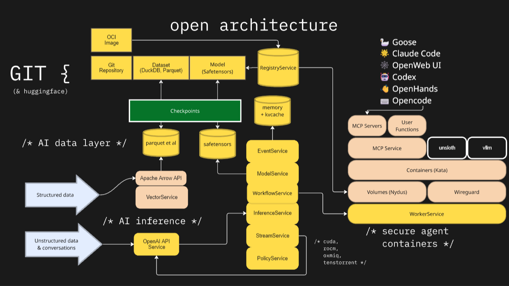

# HyprStream: the open network for self-improving AI

[](https://github.com/hyprstream/hyprstream/actions/workflows/rust.yml)
[](LICENSE-AGPLV3)
[](LICENSE-MIT)
[![DeepWiki](https://img.shields.io/badge/DeepWiki-hyprstream%2Fhyprstream-blue.svg?logo=)](https://deepwiki.com/hyprstream/hyprstream)

## Overview

**HyprStream is the runtime for AI that gets smarter the more you use it.**

Run open-weight or custom LLMs behind a drop-in OpenAI API — and watch it improve itself on your own traffic, every gain saved as a Git branch you can review, promote, or roll back. Models, tools, live inference streams, and sandboxed apps all live in **one composable, file-like namespace** that reaches from your laptop to your fleet to — federated by cryptographic identity — the open network.

It's a single abstraction that scales the whole way up: a distributed filesystem that is also the operating system, the agentic tool interface, and the substrate for a **federation of AIs that learn from each other.**

Built in Rust on PyTorch (`tch-rs`) — real inference *and* training, Git-native weights, microVM-sandboxed tool use, and a collaborative TUI for humans and agents. [Download](https://github.com/hyprstream/hyprstream/releases/) the AppImage (it auto-detects your NVIDIA or ROCm GPU) and you're running in minutes — see [docs/quickstart.md](docs/quickstart.md).

## Why HyprStream

### 🧠 Models that improve themselves

Most servers run a frozen model. HyprStream's models **get better while they serve.** They adapt to the task in front of them at inference time (test-time training with the Muon optimizer + TTN profiling), learn from a stronger model through **teacher/student training**, and propose their own improvements through MCP tools — then **agentic tools evaluate each change automatically**, so only adaptations that actually score better are kept — tried **speculatively** (applied in place, rolled back if they don't earn their keep, the way a CPU runs ahead of a branch it can undo). A runtime **rank oracle** advises how much capacity each adaptation needs; a teacher model running the evals can act on its signals or overrule them. Every accepted improvement lands as a **Git branch of the weights** (`model:branch`): versioned, diffable, reviewable, and instantly reversible. A closed improvement loop — *propose → train → evaluate → promote* — that you can audit and roll back.

### 📁 Everything is a file

Models, inference streams, MCP tools, repositories, and even **sandboxed applications** are all just files in a composable namespace. Want to run a model? Open it. Stream tokens? Read a file under `/stream/`. Drive a service? Write its `ctl` file. And you compose all of it from a **sandboxed, Unix-like shell** — `cat`, pipes, and a real scripting language — the same interface humans and agents use to drive models, tools, and apps. Give an agent a tool, or run an untrusted app, and it's a file you mount, scope, and revoke.

This Plan 9-inspired design (see [docs/vfs.md](docs/vfs.md)) gives one uniform interface for everything and per-process namespaces for true isolation. In the browser, HyprStream's WASM clients run as **[Wanix](https://github.com/tractordev/wanix) tasks**, and the VFS mounts Wanix's filesystem over 9P — so the *same* namespace spans your host and the browser. **Application sandboxing** is built in two ways: native workloads run in Kata microVMs ([docs/workers-architecture.md](docs/workers-architecture.md)); browser apps and agent tool-calls run as capability-limited Wanix WASM tasks (WASI, no ambient network) — each reachable as files, but unable to touch anything you didn't mount for it. Composable, network-transparent, capability-scoped.

### 🌐 Share models, tools, and files across nodes

Federation turns isolated servers into one network. Use a model another node hosts, call an **MCP tool** a peer publishes, or mount a remote **filesystem** or live stream — addressed by its owner's cryptographic identity and used **as if it were local.** An agent on your node can reach tools, weights, and namespaces anywhere on the fabric, every call policy-gated. No brittle URLs or per-host API keys: resources are portable and verifiable (atproto `did:web`/`did:key` + `at://` handles), reached over QUIC/WebTransport or direct peer-to-peer (iroh). It's **off by default** — opt in with the setup wizard.

### ⚡ Runs on your hardware

One binary, any accelerator. The **Universal AppImage** auto-detects and loads the right backend — **NVIDIA CUDA**, **AMD ROCm** (including gfx1151 / Strix Halo), or CPU — with per-process GPU selection and no CUDA/ROCm toolchain juggling. Also packaged as a multi-variant **Nix flake** (CPU / CUDA / ROCm). Built on the stable PyTorch C++ API (libtorch).

### Also includes

- **Collaborative TUI** — a high-speed compositing multiplexer; share terminals live with teammates and agents.
- **OpenAI-compatible API** — drop-in `/v1/chat/completions` for existing tools and client libraries.
- **MCP server** — expose inference, model management, and repo ops as tools for Claude Code, Cursor, etc.
- **Post-quantum security** — COSE hybrid-signed RPC (Ed25519 + ML-DSA-65), Casbin policy, OIDC/atproto identity.
- **Git-native weights** — models and source tracked with Git; HuggingFace-compatible.
- **Systemd integration** — optional user-level management for background workers and long-running services.

### Experimental Features

- **[Workers](docs/workers-architecture.md)** — isolated workload execution using Kata microVMs with cloud-hypervisor.
- **[Workflows]** — Git workflow files for local CI/CD and functions-as-a-service.
- **[Metrics]** — structured knowledge engine + time-series database powered by DuckDB, ADBC, and Flight.

## Installation

### Quick Install (AppImage, Linux)

Hyprstream requires `git` and `git-lfs` (available in all major Linux distros).

Download the [Universal AppImage](https://github.com/hyprstream/hyprstream/releases/). We publish AppImages for each CPU/GPU configuration; the Universal image is recommended for ease-of-use and GPU auto-detection.

```bash
# Download the latest release, then make it executable
chmod +x hyprstream-v0.4.0-x86_64.AppImage

# Guided setup (recommended): the wizard configures access policy, users,
# and API tokens. Add `-y` to accept defaults, `--start` to launch services,
# and `--enable-federation` to join the open network (see Federation below).
./hyprstream-v0.4.0-x86_64.AppImage wizard

# Add to PATH
export PATH="$HOME/.local/bin:$PATH"

# Start the services (or pass `--start` to the wizard above)
hyprstream service start
```

See [docs/quickstart.md](docs/quickstart.md) for prerequisites, source build, and first-time setup.

NOTE: For CUDA systems, make sure you have installed [CUDA Toolkit](https://developer.nvidia.com/cuda/toolkit) and set `LD_PRELOAD`:

```bash
systemctl --user set-environment LD_PRELOAD=libtorch_cuda.so && systemctl --user restart hyprstream-model
```

The installed files will be located in `$HOME/.local/hyprstream/` and `$HOME/.local/bin/`.

### Install with Nix

A multi-variant flake builds CPU, CUDA, and ROCm packages:

```bash
nix build github:hyprstream/hyprstream#cpu     # or #cuda / #rocm
```

### Building from source

```bash
# Set LIBTORCH to your libtorch path, or use --features download-libtorch
cargo build --release
```

See [docs/quickstart.md](docs/quickstart.md) for prerequisites and [DEVELOP.md](DEVELOP.md) for detailed build instructions.

### Container deployment

Hyprstream can run inside containers. See [README-Docker.md](README-Docker.md) for Docker/Kubernetes deployment.

## Quick Start

### Clone a model

Hyprstream runs Qwen3 / Qwen3.5 (dense and MoE) models cloned from Git repositories (HuggingFace, GitHub, etc.).

```bash
# Clone a model
hyprstream quick clone https://huggingface.co/Qwen/Qwen3-0.6B

# Clone with a custom name
hyprstream quick clone https://huggingface.co/Qwen/Qwen3-0.6B --name qwen3-small
```

### Managing models

Worktrees are automatically managed by hyprstream.

```bash
# List all cached models
hyprstream quick list

# Get detailed model information (model:branch format)
hyprstream quick info qwen3-small
hyprstream quick info qwen3-small:main
```

### Run inference

```bash
# Basic inference
hyprstream quick infer qwen3-small:main \
    --prompt "Explain quantum computing in simple terms"

# With options
hyprstream quick infer qwen3-small:main \
    --prompt "Write a Python function to sort a list" \
    --temperature 0.7 \
    --top-p 0.9 \
    --max-tokens 1024
```

## Everything is a file: the VFS

HyprStream is organized around a **Plan 9-inspired virtual filesystem** ([docs/vfs.md](docs/vfs.md)): resources are named files in a composable namespace rather than ad-hoc APIs. In the browser it runs on **[Wanix](https://github.com/tractordev/wanix)** — the same namespace, extended to the web.

- **Driven by a shell** — the whole namespace is scriptable from a **sandboxed, Unix-like shell**: `cat`, pipes, redirection, and a real scripting language (Tcl, via [molt](https://github.com/wduquette/molt)) — e.g. `set t [cat /config/temperature]; expr {$t + 0.1}`. The surface humans use is the surface agents use to call tools. It runs as a locked-down guest — **no direct host I/O**, dangerous commands removed, with instruction- and recursion-limits — so untrusted tool calls and scripts stay contained.
- **Models as branches** — every model is a Git repo; every adaptation is a worktree (`model:branch`). Versioned, diffable, reversible weights.
- **Streams as files** — token streams, events, and container I/O are read/written under `/stream/`-style mounts with backpressure and at-least-once / lossless QoS presets.
- **Control via `ctl`** — services are steered by writing their `ctl` file (a Plan 9 idiom), not bespoke management RPCs.
- **Tools as files** — MCP tools, repositories, and registries appear as files an agent can be granted, scoped to, and revoked from.
- **Per-process namespaces + sandboxing** — each workload gets its own namespace. Untrusted *native* workloads run in **Kata microVMs** ([docs/workers-architecture.md](docs/workers-architecture.md)); *browser* apps and agent tool-calls run as **Wanix WASM tasks** (WASI, no ambient network). Either way a sandbox is reachable as files but can't touch anything not mounted for it — capability-scoped by construction.
- **Wanix bridge** — Wanix's own filesystem mounts into the namespace at `/wanix/` over 9P, so browser and host resources compose into one tree.

The payoff is one abstraction that scales the whole way up: a **distributed filesystem** that is also the **operating system**, the **agentic tool interface**, and — federated across nodes — the substrate for a **network of AIs that learn from each other.** One namespace, all the way up.

## Federation: one network for models, tools, and files

Federation lets your node use — and offer — resources across the network instead of being a silo. Because everything is a file in a network-transparent namespace (see above), "remote" resources behave like local ones:

- **Federated models** — run a model another node hosts by its identity/name (`model:branch` or a [MIR](docs/interop/tiles-alignment.md) name); it loads and streams as if it were on your box.
- **Federated tools** — an agent on your node can call MCP tools a peer publishes (and you can offer yours), every call policy-checked.
- **Federated filesystems & streams** — mount a peer's namespace, read its event/token streams, or drive a shared service — composable across hosts.
- **Identity, not URLs** — everything is addressed by cryptographic identity (`did:web`/`did:key` + `at://` handle), so resources are portable, verifiable, and survive a host moving.

### Enable it

Federation is **off by default** — deny-by-default, your data stays yours. Turn on the open network (accept third-party apps and remote peers) via the setup wizard:

```bash
# Interactive — the wizard asks about federation during the Policy step
hyprstream wizard

# Non-interactive — opt in explicitly
hyprstream wizard -y --enable-federation
```

This applies the `federation-open` policy template. You can also scope it later with the [policy engine](#policy-engine) to allow only specific peer origins.

### Under the hood

Each node publishes an atproto-compatible identity document (`did:web`/`did:key`, `at://` handle, P-256 `#atproto` verification method, PDS-style service entry, and typed transport endpoints). Peers are admitted by a two-stage gate — an origin allowed by policy **and** a connecting key bound to a verification method in the peer's published DID (fail-closed otherwise) — and reached over QUIC/WebTransport or direct peer-to-peer via **iroh + pkarr** (dial by Ed25519 node id alone). See [docs/interop/tiles-alignment.md](docs/interop/tiles-alignment.md).

> Built for the open social web: HyprStream speaks atproto end-to-end — identity, admission, and transport — so your models, tools, and files federate with the broader Atmosphere, including atproto-native networks like [tiles.run](https://tiles.run).

## Architecture



## Integrating Hyprstream into your business or workflow

### OpenAI-Compatible REST API

HyprStream provides an OpenAI-compatible API endpoint for easy integration with existing tools and libraries:

```bash
# Start API server
hyprstream server --port 6789

# List available models (worktree-based)
curl http://localhost:6789/oai/v1/models

# Example response shows models as model:branch format
# {
#   "object": "list",
#   "data": [
#     {
#       "id": "qwen3-small:main",
#       "object": "model",
#       "created": 1762974327,
#       "owned_by": "system driver:overlay2, saved:2.3GB, age:2h cached"
#     },
#     {
#       "id": "qwen3-small:experiment-1",
#       "object": "model",
#       "created": 1762975000,
#       "owned_by": "system driver:overlay2, saved:1.8GB, age:30m"
#     }
#   ]
# }

# Make chat completions request (OpenAI-compatible)
# NOTE: Models must be referenced with branch (model:branch format)
curl -X POST http://localhost:6789/oai/v1/chat/completions \
  -H "Content-Type: application/json" \
  -d '{
    "model": "qwen3-small:main",
    "messages": [
      {"role": "user", "content": "Hello, world!"}
    ],
    "max_tokens": 100,
    "temperature": 0.7
  }'

# Or use with any OpenAI-compatible client
export OPENAI_API_KEY="dummy"
export OPENAI_BASE_URL="http://localhost:6789/oai/v1"
# Now use any OpenAI client library
# Note: Specify model as "qwen3-small:main" not just "qwen3-small"
```

#### Worktree-Based Model References

HyprStream uses Git worktrees for model management. The `/oai/v1/models` endpoint lists **all worktrees** (not base models):

- **Format**: Models are always shown as `model:branch` (e.g., `qwen3-small:main`)
- **Multiple Versions**: Each worktree (branch) appears as a separate model
- **Metadata**: The `owned_by` field includes worktree metadata:
  - Storage driver (e.g., `driver:overlay2`)
  - Space saved via CoW (e.g., `saved:2.3GB`)
  - Worktree age (e.g., `age:2h`)
  - Cache status (`cached` if loaded in memory)

**Example**: If you have a model `qwen3-small` with branches `main`, `experiment-1`, and `training`, the API will list three separate entries:
- `qwen3-small:main`
- `qwen3-small:experiment-1`
- `qwen3-small:training`

This allows you to work with multiple versions of the same model simultaneously, each in its own worktree with isolated changes.

### MCP Integration (Claude Code, Cursor, etc.)

HyprStream includes a built-in [Model Context Protocol](https://modelcontextprotocol.io/) server that exposes inference, model management, and repository operations as tools for AI coding assistants.

**1. Configure Claude Code:**

```
claude mcp add --transport http hyprstream http://localhost:6790/mcp
```

**2. Authenticate**

Use `/mcp`, select `hyprstream`, and select `Authenticate` or `Re-authenticate`.

**3. Available tools:**

Once connected, Claude Code can use hyprstream tools directly:

| Tool | Description |
|------|-------------|
| `model.load` | Load a model for inference |
| `model.list` | List loaded models |
| `model.status` | Get model status and memory usage |
| `registry.list` | List all cloned repositories |
| `registry.clone` | Clone a model from HuggingFace/GitHub |
| `repo.*` | Branch, worktree, merge, and tag operations |
| `policy.*` | Policy checks and token management |

**Configuration:**

The MCP server listens on port 6790 by default. To change it, set in your hyprstream config:

```toml
[mcp]
host = "127.0.0.1"
http_port = 6790
```

Or configure via the [OAI-compatible API](#openai-compatible-rest-api) on port 6789 for non-MCP clients.

### Advanced deployments

HyprStream can be configured via environment variables with the `HYPRSTREAM_` prefix:

```bash
# Server configuration
export HYPRSTREAM_SERVER_HOST=0.0.0.0
export HYPRSTREAM_SERVER_PORT=6789
export HYPRSTREAM_API_KEY=your-api-key

# CORS settings
export HYPRSTREAM_CORS_ENABLED=true
export HYPRSTREAM_CORS_ORIGINS="*"

# Model management
export HYPRSTREAM_PRELOAD_MODELS=model1,model2,model3
export HYPRSTREAM_MAX_CACHED_MODELS=5
export HYPRSTREAM_MODELS_DIR=/custom/models/path

# Performance tuning
export HYPRSTREAM_USE_MMAP=true
export HYPRSTREAM_GENERATION_TIMEOUT=120
```

## Security & Authentication

Hyprstream implements layered, zero-trust, **post-quantum-ready** security.

### Security Layers

| Layer | Technology | Purpose |
|-------|------------|---------|
| **Transport** | QUIC / WebTransport + iroh (TLS / Noise) | Encrypted, NAT-traversing transport for browsers, hosts, and P2P peers |
| **Application** | COSE hybrid-signed envelopes (Ed25519 + ML-DSA-65) | Request authentication + integrity with post-quantum signatures |
| **Identity** | atproto `did:web`/`did:key` + federation admission | Identity-bound peering (origin policy + DID-key binding) |
| **Authorization** | Casbin policy engine | RBAC/ABAC access control, deny-by-default |
| **Isolation** | Kata Containers (optional) | microVM-level workload isolation for workers |

### RPC & streaming architecture

Inter-service and inter-node communication runs over **moq-net** (moq-lite streaming) and **iroh**, with Cap'n Proto serialization:

- **Request/reply RPC** over QUIC/WebTransport (browsers, reachable hosts) and iroh (direct P2P).
- **Event bus** over a moq-lite "Live" stream (replaces the legacy pub/sub proxy).
- **Streaming plane** — moq groups carry token streams, events, and container I/O, with QoS presets (`Job` / `Log` / `Pipe`), per-frame chained-HMAC integrity, and AEAD payloads so a forwarding relay never sees plaintext.

Every request is wrapped in a **COSE hybrid-signed envelope**:
- Ed25519 + ML-DSA-65 composite signature over the request (classical + post-quantum)
- Nonce for replay protection and timestamp for clock-skew validation
- Request identity (Local user, API token, federated Peer, or Anonymous)

### Service Spawning

Services can run in multiple modes:
- **Tokio task**: In-process async execution
- **Dedicated thread**: For `!Send` types (e.g., tch-rs tensors)
- **Subprocess**: Isolated process with systemd or standalone backend

See [docs/rpc-architecture.md](docs/rpc-architecture.md) and [docs/streaming-service-architecture.md](docs/streaming-service-architecture.md) for details.

## Policy Engine

**Quick Start:**
```bash
# View current policy
hyprstream policy show

# Check if a user has permission
hyprstream policy check alice model:qwen3-small infer

# Create an API token
hyprstream policy token create \
  --user alice \
  --name "dev-token" \
  --expires 30d \
  --scope "model:*"

# Apply a built-in template -- allow all local users access to all actions on all resources
hyprstream policy apply-template local
```

**Built-in Templates:**
- `local` - Full access for local users (default)
- `public-inference` - Anonymous inference access
- `public-read` - Anonymous read-only registry access

**Worker Resources** (experimental):
| Resource | Description |
|----------|-------------|
| `sandbox:*`, `sandbox:{id}` | Pod sandbox (Kata VM) operations |
| `container:*`, `container:{id}` | Container lifecycle within sandboxes |
| `image:*`, `image:{name}` | Image pull/push/list operations |
| `workflow:*`, `workflow:{path}` | Workflow execution (.github/workflows/*.yml) |
| `tool:*`, `tool:{name}` | MCP tool access (tool:bash, tool:read_file) |

**Policy History & Rollback:**
```bash
# View policy commit history
hyprstream policy history

# Compare draft vs running policy
hyprstream policy diff

# Rollback to previous version
hyprstream policy rollback HEAD~1
```

**REST API Authentication:**
```bash
# Create a token
hyprstream policy token create --user alice --name "my-token" --expires 1d

# Use with API requests
curl -H "Authorization: Bearer eyJ..." http://localhost:6789/oai/v1/models
```

See [docs/rpc-architecture.md](docs/rpc-architecture.md) for detailed RPC and service infrastructure documentation.

## Telemetry & Observability

HyprStream supports OpenTelemetry for distributed tracing, enabled via the `otel` feature flag.

### Building with OpenTelemetry

```bash
# Build with otel support
cargo build --features otel --release

# Combine with other features
cargo build --no-default-features --features tch-cuda,otel --release
```

### OpenTelemetry Configuration

| Environment Variable | Purpose | Default |
|---------------------|---------|---------|
| `HYPRSTREAM_OTEL_ENABLE` | Enable/disable telemetry | `false` |
| `OTEL_EXPORTER_OTLP_ENDPOINT` | OTLP backend endpoint | `http://localhost:4317` |
| `OTEL_SERVICE_NAME` | Service name in traces | `hyprstream` |
| `HYPRSTREAM_LOG_DIR` | File logging directory | None (console only) |

### Usage Examples

**Local development (stdout exporter):**
```bash
export HYPRSTREAM_OTEL_ENABLE=true
export RUST_LOG=hyprstream=debug
hyprstream server --port 6789
# Spans printed to console
```

**Production (OTLP to Jaeger/Tempo):**
```bash
export HYPRSTREAM_OTEL_ENABLE=true
export OTEL_EXPORTER_OTLP_ENDPOINT=http://jaeger:4317
export OTEL_SERVICE_NAME=hyprstream-prod
hyprstream server --port 6789
```

**File logging (separate from OTEL):**
```bash
export HYPRSTREAM_LOG_DIR=/var/log/hyprstream
hyprstream server --port 6789
# Creates daily-rotated logs at /var/log/hyprstream/hyprstream.log
```

### Exporter Modes

- **OTLP**: Used automatically when running `server` command; sends traces to backends like Jaeger, Tempo, or Datadog
- **Stdout**: Used for CLI commands; prints spans to console for debugging

### Debugging GPU detection issues:

If the Universal AppImage is not detecting your GPU, you may override the settings:

```bash
# List all available backends
./hyprstream-x86_64.AppImage --list-backends

# Detect available backends
./hyprstream-x86_64.AppImage --detect-gpu

# Override backend selection for Universal AppImage:
HYPRSTREAM_BACKEND=cuda130 ./hyprstream-x86_64.AppImage server
```

### System Requirements

- **Operating System**: Linux (x86_64, ARM64)
- **Inference Service Requirements (optional):**
  - **CPU**: Full support (x86_64, ARM64)
  - **CUDA**: NVIDIA host kernel modules (`nvidia-smi` works)
  - **ROCm**: AMDGPU kernel modules and userland (`rocm-smi` works)
- **Workers Service Requirements (optional, experimental):**
  - **Nested Virtualization**: The host system running hyprstream-workers must support and have enabled nested virtualization, this may require a physical machine, bare-metal VM, or proper configuration in your QEMU/KVM settings.
- 8GB+ RAM for inference, 16GB+ for training
- **Optional Dependencies:**
  - `systemd` - For service management and worker process isolation
  - `cloud-hypervisor` - For Kata container workers (experimental)

## Contributing

See [CONTRIBUTING.md](CONTRIBUTING.md) for guidelines.

## License

This project uses a dual-licensing model:

**AGPL-3.0** - The end-user experience and crates providing public APIs:
- `hyprstream` (main application)
- `hyprstream-metrics`
- `hyprstream-flight`

See [LICENSE-AGPLV3](LICENSE-AGPLV3) for details.

**MIT** - Library crates for broader reuse:
- `git2db` - Git repository management
- `gittorrent` - P2P git transport
- `git-xet-filter` - XET large file storage filter
- `cas-serve` - CAS server for XET over SSH
- `hyprstream-rpc` - RPC infrastructure
- `hyprstream-rpc-derive` - RPC derive macros

See [LICENSE-MIT](LICENSE-MIT) for details.

## Acknowledgments

Built with:
- [PyTorch](https://pytorch.org/) - Deep learning framework
- [tch](https://github.com/LaurentMazare/tch-rs) - Rust bindings for PyTorch
- [SafeTensors](https://github.com/huggingface/safetensors) - Efficient tensor serialization
- [Git2](https://github.com/rust-lang/git2-rs) - Git operations in Rust
- [Tokio](https://tokio.rs/) - Async runtime
- [iroh](https://www.iroh.computer/) - Peer-to-peer QUIC transport and discovery
- [Casbin](https://casbin.org/) - Authorization library for policy engine
- [Kata Containers](https://katacontainers.io/) - VM-based container isolation (experimental)
- [cloud-hypervisor](https://www.cloudhypervisor.org/) - Virtual machine monitor (experimental)
