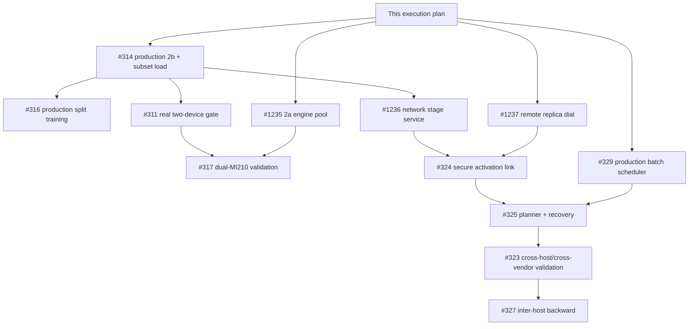

# Multi-host inference execution plan

**Date:** 2026-07-23

**Status:** Authoritative execution plan

**Code baseline:** `origin/main` at `69eda14916c0870c16f101eb4147f637e09f2043`

## Authority and scope

This document is the sole execution plan for multi-device and multi-host inference and split
training. The 2026-06-18 architecture spike remains historical design rationale only:
`782d5705d:docs/plans/2026-06-18-multi-gpu-multi-host-inference-spike.md`. Its choice of contiguous
decoder stages, hidden-state hand-off, stage-local KV/SSM state, and local 2b before network 2c
remains the design basis (`:148-188`, `:261-287`); its phases, estimates, ticket state, and execution
instructions are not normative.

The delivery paths are:

- **2a:** N whole-model `TorchEngine` replicas on N local GPUs for throughput.
- **2b:** one model split into contiguous decoder stages across local GPUs.
- **2c:** the same stage contract across authenticated inference services on different hosts.
- **Split training:** local cross-device autograd first, then backward activation-gradient transport
  across a validated 2c chain.

Tensor/expert parallelism and intra-layer collectives remain deferred. They become a separate
roadmap item only when a single decoder or resident-expert layer cannot fit one device. No current
runtime implementation of `all_reduce`, tensor parallelism, or NCCL collectives was found
(`crates/hyprstream/src/runtime`; assessment evidence in the 2026-07-23 report).

### Non-negotiable closure rule

> A ticket closes only when a production caller and an acceptance test exist.

A constructor, trait method, helper, mocked assignment, CPU-only equivalence test, or unused public
API is not delivery. For validation-only tickets, “production caller” means the acceptance harness
must drive the production service/engine path, not call an architecture helper directly. Every PR
must name the production caller and the test that proves it; if either is absent, the owning ticket
stays open.

## Code-grounded baseline

The code already establishes the shape of the solution:

- `DevicePool`, contiguous `LayerDeviceMap`, stage constructors, range forwards, and one-thread
  multi-device ownership exist (`crates/hyprstream/src/runtime/device_pool.rs:13-28`,
  `crates/hyprstream/src/runtime/architectures/mod.rs:376-413`).
- The first stage embeds tokens, middle stages own `[start_layer,end_layer)`, and the last stage owns
  final norm and LM head. The stage boundary is `hidden` plus `start_pos`; positional tensors are
  reconstructed and KV plus Qwen3.5 conv/recurrent state remains stage-local
  (`crates/hyprstream/src/runtime/architectures/mod.rs:376-409`).
- Llama's range runner copies `hidden` and device-bound `position_ids` at an actual device change
  (`crates/hyprstream/src/runtime/architectures/llama.rs:2632-2644`).

Those primitives are not yet production 2b or 2c:

- `TorchEngine` production inference calls `forward_with_cache`
  (`crates/hyprstream/src/runtime/torch_engine.rs:1091-1098`), while Llama's corresponding cached
  loop does not perform the range runner's boundary move
  (`crates/hyprstream/src/runtime/architectures/llama.rs:2296-2339`).
- The loader materializes every shard on the primary device before construction
  (`crates/hyprstream/src/runtime/model_factory.rs:252-284`,
  `crates/hyprstream/src/runtime/model_factory.rs:425-499`).
- Qwen3.5 exposes stage/range primitives but `ModelFactory` explicitly falls back to one device
  (`crates/hyprstream/src/runtime/model_factory.rs:702-711`).
- Llama has `forward_batched` and `TorchEngine::forward_batched_step`, but no production scheduler
  calls the latter (`crates/hyprstream/src/runtime/architectures/mod.rs:258-279`,
  `crates/hyprstream/src/runtime/torch_engine.rs:1151-1184`). Scheduler configuration defaults off
  (`crates/hyprstream/src/config/mod.rs:1748-1771`).
- There is no stage execution handler in the model or inference service. The router seeds one local
  replica and a selected remote replica deliberately falls back to the local client
  (`crates/hyprstream/src/services/model.rs:448-492`,
  `crates/hyprstream/src/services/model.rs:847-875`).
- The current real-GPU generation test stays single-device; CPU tests containing `Device::Cuda`
  values do not execute a CUDA boundary (`crates/hyprstream/tests/e2e_inference.rs:610-631`,
  `crates/hyprstream/tests/e2e_inference.rs:704-735`).

These citations are the implementation baseline from the 2026-07-23 code assessment. Ticket state
is never implementation evidence.

## Support matrix

Legend: **Production** means a production caller and acceptance test exist; **primitive** means code
shape or direct tests exist but no accepted production path; **planned** names the owning ticket;
**out** is deliberately outside that architecture's current contract.

| Architecture | Whole-model | Local stage (2b) | Remote stage (2c) | Cached decode | Batched decode | Split training |
|---|---|---|---|---|---|---|
| Dense Llama supported by `ModelFactory` | **Production**, single device | **Primitive**: stage/range code exists; production boundary execution and subset load are [#314](https://github.com/hyprstream/hyprstream/issues/314) | **Planned**: [#1236](https://github.com/hyprstream/hyprstream/issues/1236), [#324](https://github.com/hyprstream/hyprstream/issues/324), [#325](https://github.com/hyprstream/hyprstream/issues/325) | **Production** on one device; multi-device caller/boundary is **#314** | **Primitive** kernel/step; production admission and scheduling are [#329](https://github.com/hyprstream/hyprstream/issues/329), with multi-device boundary behavior in **#314** | **Primitive** local helper/tests; production trainer is [#316](https://github.com/hyprstream/hyprstream/issues/316), remote backward is [#327](https://github.com/hyprstream/hyprstream/issues/327) |
| Qwen3.5 hybrid attention/SSM | **Production**, single device | **Primitive but not advertised**: factory forces one device; global/local layer state and subset construction remain **#314** | **Out for v1** until local-stage factory support and exact SSM state accounting pass, then uses the same #1236/#324 ABI | **Production** on one device; staged cached decode is not supported until **#314** | **Out for v1**; the accepted batched primitive is Llama-specific | **Primitive** equivalence only; not production-supported until **#316** wires the trainer and the architecture passes real-hardware state/gradient affinity |

An architecture not listed in this matrix must fail stage capability negotiation. V1 2b/2c
acceptance uses a dense Llama-family checkpoint supported by the production factory. Qwen3.5 must not
be used to claim staged acceptance while its factory fallback remains
(`crates/hyprstream/src/runtime/model_factory.rs:702-711`).

## Normative stage contract

The field semantics below are normative; Rust type names and serialization layout may change during
implementation. A capability is not advertised until its implementation reaches the production
factory and service.

### Stage descriptor and lifecycle

```text
StageDescriptor {
  stage_abi_version,
  model_oid,
  config_digest,
  hf_index_digest,
  plan_digest,
  architecture,
  storage_dtype,
  compute_dtype,
  stage_id,
  stage_count,
  start_layer,               // inclusive global decoder layer
  end_layer,                 // exclusive global decoder layer
  is_first,
  is_last,
  input_kind,                // token_ids for first; hidden for every other stage
  output_kind,               // logits for last; hidden for every other stage
  selected_tensor_names,
  selected_shard_files,
  indexed_weight_bytes,
  runtime_memory_limit,
  max_context,
  max_batch,
  activation_codec,
  max_chunk_bytes,
  receive_credit_bytes,
  admitted_host_identity,
  admitted_reach,
  provenance_key_epoch,
}
```

- `model_oid` identifies the immutable checkpoint revision. `config_digest` and `hf_index_digest`
  bind the exact `config.json` and `model.safetensors.index.json` bytes to it.
- `plan_digest` is the digest of the canonical complete launch plan: model and index identity,
  ordered stages, exact global ranges and first/last roles, admitted host identities and reaches,
  dtype/ABI, selected shards, codec/chunk/credit limits, replicas, and recovery policy. Any stage
  mismatch fails closed.
- Global ranges are contiguous, gap-free, non-overlapping, cover every decoder layer exactly once,
  and use global IDs on the wire. A stage may use local vectors only through an explicit
  `global_layer - start_layer` mapping.
- `PrepareStage(descriptor)` is authenticated and idempotent by
  `(model_oid, plan_digest, stage_id)`. It returns ready only after the indexed subset and all
  stage-local KV/SSM resources needed for the admitted limits are usable. The ready response reports
  measured weight, persistent runtime, reserved cache, and transport-buffer bytes.
- `UnloadStage(model_oid, plan_digest, stage_id)` is authenticated and idempotent. It drains or
  rejects new requests, cancels active epochs under the declared policy, clears device-local state,
  and releases all allocations before success.
- Health and capacity responses identify the descriptor and distinguish `loading`, `ready`,
  `draining`, `failed`, and `unloaded`. Readiness for one OID/plan/range cannot satisfy another.

### Per-request execution

```text
StageInvocation {
  model_oid,
  plan_digest,
  request_id,
  session_id,
  tenant_id,
  delta_revision,
  pipeline_epoch,
  microbatch_id,
  sequence_id,
  activation_seq,
  phase,                     // prefill | decode
  start_pos,
  accepted_token_index,      // absent for prefill; zero-based token consumed for decode
  input,                     // token_ids or a verified logical activation
  cancellation_deadline,
}
```

For a fixed `(request_id, session_id, pipeline_epoch, microbatch_id, sequence_id, stage_id)`,
`activation_seq=0` is the one prefill invocation. Decode invocation for generated token `t` has
`accepted_token_index=t` and `activation_seq=t+1`. A stage commits sequence `n` before executing
`n+1`. Duplicate delivery with the same identity and digest is idempotent and returns the recorded
completion; a conflicting duplicate is a terminal protocol error.

The first stage accepts token IDs and embeds them. Every middle stage accepts hidden state. The last
stage produces logits for sampling; it does not send another activation. Each stage reconstructs
position IDs from `start_pos`; position IDs never cross a host. KV and SSM conv/recurrent state are
owned by the request/epoch/sequence and the stage's global layer range. State is never shared between
2a replicas or between microbatch rows. The current separate-cache-per-row interface is the model
(`crates/hyprstream/src/runtime/architectures/mod.rs:258-275`).

The local 2b fast path obeys the same invocation identity and ordering without serialization. It
executes on the existing single bridge thread, moves `hidden` and any device-bound positional tensor
exactly once per actual device boundary, and never moves a `tch::Tensor` across a Rust thread.

## Normative activation wire contract

One logical boundary activation is a dense tensor:

```text
hidden shape = [B, Q, H]
logical bytes = B * Q * H * sizeof(dtype)
```

The range ABI establishes `[B,Q,H]` (`crates/hyprstream/src/runtime/architectures/mod.rs:404-409`).
BF16/FP16 uses two bytes and FP32 four bytes
(`crates/hyprstream/src/training/tenant_delta.rs:1134-1142`). For example, BF16
`[1,8192,4096]` is exactly 67,108,864 bytes before envelope/authentication overhead. This is a
representative payload, not a claimed MoQ ceiling. The only located 64 MiB cap belongs to legacy
ZMTP, while Iroh RPC control messages are capped at 4 MiB
(`crates/hyprstream-rpc/src/zmtp_framing.rs:26-27`,
`crates/hyprstream-rpc/src/transport/rpc_session.rs:42-50`). Activation bytes use the data plane and
are chunked for bounded memory and credit control.

Every chunk carries or cryptographically binds this envelope:

```text
ActivationChunk {
  wire_version,
  message_kind,              // data | ack | credit | cancel | terminal | error
  model_oid,
  plan_digest,
  request_id,
  session_id,
  tenant_id,
  delta_revision,
  pipeline_epoch,
  microbatch_id,
  sequence_id,
  activation_seq,
  source_stage_id,
  destination_stage_id,
  global_layer_boundary,
  phase,
  start_pos,
  accepted_token_index,
  dtype,
  rank,
  shape,
  logical_byte_length,
  codec,
  chunk_index,
  chunk_count,
  chunk_offset,
  chunk_length,
  whole_activation_digest,
  transport_sequence,
  credit_grant_total,
  consumed_byte_total,
  authorization_context_digest,
  provenance_source_identity,
  provenance_key_epoch,
  provenance_statement_digest,
  provenance_signature,
  aead_suite,
  aead_key_epoch,
  aead_nonce,
  aead_tag,
  terminal_code,
}
```

### Reassembly and sequencing

- The ordering key is `(request_id, session_id, pipeline_epoch, microbatch_id, sequence_id,
  source_stage_id, destination_stage_id)`. `activation_seq` follows the prefill/decode rule above.
  Prefill must commit at every stage before decode sequence 1 enters that stage; sequence `n` must
  commit before `n+1`.
- The receiver validates dtype, rank, dimensions, multiplication overflow, and
  `logical_byte_length` before allocation. Chunks must form one exact, gap-free partition of
  `[0, logical_byte_length)`. Overlap, gaps, inconsistent metadata, excess bytes, digest mismatch, or
  stale epoch terminates the request epoch.
- A complete activation executes only after whole-activation digest verification and predecessor
  commit. The existing MoQ consumer's exact group-sequence read is the lower-level precedent
  (`crates/hyprstream-rpc/src/moq_stream.rs:1208-1215`).
- An exact duplicate chunk or activation may be re-ACKed but is never executed twice. A duplicate
  offset with different authenticated bytes is a protocol violation.
- Interleaving is allowed only across isolated ordering keys. Ready and executor queues remain
  byte-bounded even when many small decode activations are admitted.

### Byte credits and acknowledgements

Credits are bytes, never item counts. Each direction maintains monotonic `credit_grant_total`,
`sent_byte_total`, and `consumed_byte_total` counters scoped to the authenticated link, plan, and
epoch.

1. Before sending a chunk of `n` bytes, the producer requires
   `sent_byte_total + n <= credit_grant_total`; it then increments `sent_byte_total`.
2. The receiver accounts envelope plus payload against bounded producer, in-flight, reassembly,
   ready, and executor budgets. A message-count channel is not an admission bound; current MoQ
   consumers use 64-item channels while publication does not await application credits
   (`crates/hyprstream-rpc/src/moq_stream.rs:901`,
   `crates/hyprstream-rpc/src/moq_stream.rs:930`,
   `crates/hyprstream-rpc/src/moq_stream.rs:996`,
   `crates/hyprstream-rpc/src/moq_stream.rs:1060`,
   `crates/hyprstream-rpc/src/moq_stream.rs:652-658`).
3. Credit is returned only when bytes are consumed by the executor or their buffer is released due
   to cancellation/error. The receiver advances `consumed_byte_total`, then raises
   `credit_grant_total` by no more than the configured window.
4. ACK identifies the highest contiguous committed `activation_seq`, its output digest, and the
   cumulative consumed/grant counters. Counter regression, overflow, replay under another epoch, or
   a grant above the plan limit fails closed.

`#324` must benchmark a fixed header plus raw contiguous bytes against safetensors, including
GPU-to-CPU extraction, allocation, authentication, decode, and CPU-to-GPU upload. Safetensors is a
correct CPU reference—the receiver chooses the destination device
(`crates/hyprstream/src/training/tenant_delta.rs:1109-1130`)—but it is not assumed efficient for
small decode tensors.

### Authentication, provenance, and cancellation

- Stage traffic requires an identity-bound Iroh channel plus application authorization for the
  tenant, model OID, plan, role, and stage boundary. Co-location is not authorization.
- AEAD and host provenance are mandatory with no keyless, integrity-only, anonymous, wildcard, or
  provenance-optional downgrade. All envelope fields are associated data. Whole-activation digest,
  source/destination identities, authorization context, and key epochs are covered by the signed
  provenance statement. AEAD nonces are unique for the link key and are derived from or bound to the
  epoch plus transport sequence; nonce reuse is a terminal link error.
- The current mesh stream supplies ordered sequence numbers, chained HMAC, AEAD machinery, and a
  fail-closed provenance verifier (`crates/hyprstream-rpc/src/moq_stream.rs:593-623`,
  `crates/hyprstream-rpc/src/moq_stream.rs:733-805`,
  `crates/hyprstream-rpc/src/moq_stream.rs:1885-1928`). `#324` selects the mandatory profile and
  removes optionality for stage traffic.
- `Cancel(request_id, session_id, pipeline_epoch, reason)` is authenticated and idempotent. It stops
  admission and execution, invalidates the epoch, discards partial reassembly, releases credits,
  clears stage-local request caches, and propagates both directions. `CancelAck` is sent only after
  buffers and executor ownership are released. Deadline expiry has the same semantics.
- Any terminal protocol, authorization, stage, or execution error invalidates the entire request
  epoch. Continuing with a partial chain is forbidden.

## Authoritative subset loading and runtime memory

Stage mode requires both `config.json` and `model.safetensors.index.json`. Missing, inconsistent, or
fallback metadata is a hard error; no regex layer count, default layer count, shard glob, CPU
fallback, or whole-model load is allowed.

### Load algorithm

1. Read and authenticate the checkpoint revision, `config.json`, and HF index before opening a
   weight shard. Verify their digests against `model_oid` and `StageDescriptor`.
2. Parse architecture and global layer count from `config.json`. Validate that indexed layer keys
   cover exactly those global IDs and that the architecture is in the support matrix.
3. Select exact tensor names from the architecture schema:
   - decoder tensors only for global layers `[start_layer,end_layer)`;
   - embedding tensors only when `is_first`;
   - final norm and LM-head tensors only when `is_last`;
   - every required bias, quantization/FP8 scale, and architecture-specific state tensor associated
     with the selected weights.
4. Resolve each selected tensor through the authoritative HF `weight_map`. The resulting shard-file
   set is an I/O optimization, not permission to upload every tensor in those files.
5. Open/mmap each required shard on CPU, validate its safetensors header, and copy only selected
   tensors to the owning device. Unrelated tensors must never be materialized on the primary GPU or
   any stage GPU as an intermediate.
6. Construct layer state with global IDs and an explicit global-to-local map. Size KV state and
   Qwen3.5 conv/recurrent state to the owned range, not global `num_hidden_layers`.
7. Reconcile every selected tensor name, dtype, shape, byte range, shard, and actual device
   allocation. Missing, duplicate, overlapping, unexpected-required, or wrong-device data fails
   readiness.

This replaces the current all-primary loader
(`crates/hyprstream/src/runtime/model_factory.rs:252-284`,
`crates/hyprstream/src/runtime/model_factory.rs:425-499`). First/last weight ownership follows the
existing stage constructors (`crates/hyprstream/src/runtime/architectures/llama.rs:1623-1692`).

### Accounting contract

The planner and ready response use exact bytes, not equal-layer estimates or manifest
`metadata.total_size`. For each stage:

```text
admitted_peak_bytes =
    indexed_weight_bytes
  + persistent_model_state_bytes
  + kv_capacity_bytes
  + ssm_or_recurrent_state_bytes
  + tenant_delta_bytes
  + training_gradient_optimizer_bytes
  + activation_working_set_bytes
  + transport_reassembly_ready_executor_bytes
  + backend_workspace_bytes
  + allocator_safety_bytes
```

- `indexed_weight_bytes` is the sum of selected tensors' validated storage lengths from safetensors
  headers, including scales and nonuniform/hybrid layers.
- KV/state capacity is computed from owned layers, admitted context, batch/microbatch width, heads,
  head dimensions, cache dtype/quantization, and architecture-specific recurrent/conv state.
- Activation and transport bytes derive from `[B,Q,H]`, codec overhead, chunk size, each queue's
  byte limit, reassembly concurrency, and the credit window. The same bytes cannot be hidden in an
  unexplained constant reserve.
- Delta, gradient, and optimizer terms are zero only for an inference-only admission. Split-training
  admission must state the actual precision and ownership of all three.
- Backend workspace and allocator safety are measured per backend/model shape and versioned with the
  capability. Usable VRAM is physical VRAM minus observed non-Hyprstream baseline and declared
  reserve, not a fixed fraction of total VRAM.

Acceptance records planned and measured peak HBM per device during load, maximum prefill, repeated
decode, admitted batch, cancellation, and teardown. Measured peak must remain within the declared
bound plus an explicit allocator-observation tolerance, and unrelated stages must not cause a
transient primary-device spike. Capacity advertisements use measured post-load free memory and
decrease as KV/transport credits are admitted.

## Recovery and output commits

The safe baseline is whole-request epoch replacement and replay. Stage KV/SSM memory is disposable;
the coordinator state below is durable or reconstructable:

- model OID, config/index/tokenizer revisions, tenant and delta revision;
- canonical plan/admission record, stage ranges, identities/reaches, codec/credit contract, and
  recovery policy;
- original prompt and the ordered accepted generated-token log;
- sampling parameters and RNG state after each accepted token, or the committed sampled-token
  decision needed to reproduce it;
- request/session ID, current pipeline epoch, and per-microbatch/sequence state;
- replacement readiness and the output log/ack watermarks.

Each microbatch state advances monotonically through `admitted`, `reassembled`, `running`,
`stage_committed`, `output_prepared`, `output_log_committed`, `client_acked`, or terminal
`cancelled/failed`. A completion from an older epoch cannot advance any state.

### Output-commit semantics

Every client output unit has `(request_id, output_index, token_id, encoded_bytes, digest)`.

1. Sampling appends the token decision and post-sampling RNG state to the durable ordered decision
   log.
2. The exact client bytes and digest are durably appended to the output replay log before exposure.
   This advances `output_log_commit` only across a contiguous prefix.
3. The client adapter sends from that log with `output_index` as an idempotency/resume key.
   Acknowledgement advances `client_ack_commit` only across a contiguous prefix.
4. Recovery resumes generation after the last token decision and retransmits logged but unacknowledged
   output with the same index and bytes. It never resamples, renumbers, or emits an unlogged output.

The native API must expose resume/deduplication by output index. A transport without client
acknowledgement can promise ordered, gap-free replay with stable IDs but cannot claim network-level
exactly-once delivery; its client must deduplicate. This makes the crash-between-write-and-ack case
explicit instead of silently risking duplicate or skipped text.

### Replacement sequence

On stage, link, timeout, or host failure:

1. Stop new admission and fence the old `pipeline_epoch`.
2. Authenticate and propagate cancellation; reject all old-epoch chunks, credits, ACKs, completions,
   and output attempts.
3. Discard partial reassemblies and release their credits. Preserve only the durable coordinator and
   output logs.
4. Select and admit a replacement chain, increment the epoch, prepare exact OID/plan/ranges, and wait
   for every stage to report ready.
5. Replay the prompt and accepted-token log with output suppressed to reconstruct every stage's
   cache and recurrent state. Verify replay reaches the committed token/RNG watermark.
6. Retransmit any logged but unacknowledged client output, then resume generation at the next output
   index.

Keeping only in-flight microbatch IDs is insufficient; prompt/token/RNG and last client-visible
commit are necessary to recover without resampling
(`crates/hyprstream/src/runtime/architectures/mod.rs:390-396`; historical recovery spike material is
in `origin/pr/1222:crates/hyprstream/src/runtime/interhost_pipeline.rs:974-1007` and `:1082-1125`).

## Dependency DAG and issue ownership

An arrow means the predecessor's merge gate must be green before the successor PR merges. Successor
work may begin behind an interface or draft PR, but it may not merge by mocking the missing
production dependency.



| Owner issue | Owns, and explicit merge gate |
|---|---|
| [#314](https://github.com/hyprstream/hyprstream/issues/314) — **[P1] Finish production 2b: range forward, boundary copies, and true stage loading** | Owns both production cached/range boundary execution and authoritative stage loading. Gate: supported dense architecture reaches production prefill, repeated decode, direct batched-step boundary test, one copy per actual boundary per forward, single-device parity, and bounded subset HBM. Both work items, one production caller, and acceptance tests must land before closure. |
| [#316](https://github.com/hyprstream/hyprstream/issues/316) — **[P1] TTT-on-split: cross-device autograd over the pipeline partition** | Owns production trainer calls to split forward/loss and real cross-device autograd. Gate: #314 merged; production trainer matches single-device loss and per-parameter gradients within declared tolerance while gradients/state remain on owning devices. |
| [#1235](https://github.com/hyprstream/hyprstream/issues/1235) — **[P1] 2a local engine pool: one TorchEngine replica per GPU** | Owns N full-model engines, health/admission, session affinity, state isolation, per-device startup failure, backpressure, cancellation, and teardown. Gate: production `InferenceService` caller, CPU scheduler tests, and real dual-GPU concurrent isolation/teardown. It is independent of #314. |
| [#311](https://github.com/hyprstream/hyprstream/issues/311) — **[P1] Two-device lifecycle gate: prove one-thread multi-device on real hardware** | Owns the one-thread/two-physical-device feasibility gate. Gate: #314 merged; production load, prefill, repeated cached decode, RoPE reuse, cancellation, boundary assertion, and teardown on `Cuda(0) -> Cuda(1)`. CPU or enum-only tests cannot close it. |
| [#317](https://github.com/hyprstream/hyprstream/issues/317) — **[P1 validation] Dual-MI210 2b parity and 2a throughput** | Owns numerical/performance acceptance for 2b and throughput/state acceptance for 2a, not either implementation. Gate: #311 and #1235 green; the real-hardware acceptance below is published. |
| [#1237](https://github.com/hyprstream/hyprstream/issues/1237) — **[P3] Dial the selected remote inference replica; remove local fallback** | Owns discovery-populated replica sets, reach resolution/authorization, real remote client construction, explicit reselection, affinity, and served-replica identity. Gate: production model-service caller covers local, remote, unauthorized, unreachable, and no-candidate cases with no silent local fallback. It may merge independently of local 2b. |
| [#1236](https://github.com/hyprstream/hyprstream/issues/1236) — **[P4] Network-addressable inference stage service and lifecycle** | Owns authenticated prepare/readiness, range execution, request cache lifecycle, capacity/health/drain/cancel/unload, and two-process reachability. Gate: #314 merged; a production service client loads an exact subset and runs prefill plus decode without crossing a tensor over a Rust thread. |
| [#329](https://github.com/hyprstream/hyprstream/issues/329) — **[P3/P4] Continuous (in-flight) batching — net-new; prerequisite for inter-host pipeline (2c) throughput** | Owns bounded admission, same-delta grouping, prefill/decode interleaving, per-row KV ownership, fairness, cancellation, and the production caller of `forward_batched_step`. Gate: mixed lengths, isolation, cancellation, starvation, bounded bytes/requests, and production service acceptance. It may merge independently before #325. |
| [#324](https://github.com/hyprstream/hyprstream/issues/324) — **[P4] Inter-host activation protocol: codec, credits, ordering, and secure stage link** | Owns the normative activation envelope, codec/chunking, exact reassembly, byte credits, sequencing, AEAD/provenance, epoch/cancellation, and stage data-plane integration. Gate: #1236 and #1237 merged; authenticated two-process production stage execution passes protocol, corruption, backpressure, cancellation, and bounded-memory tests. |
| [#325](https://github.com/hyprstream/hyprstream/issues/325) — **[P4] Executable inter-host pipeline planning, admission, and recovery** | Owns exact capacity-aware placement, a launchable admitted chain, production planner invocation, recovery coordination, replay, and output commits. Gate: #324 and #329 merged; production request launches from planner output, injected stage failure replaces/replays the chain, fences stale completion, and resumes without skipped or differently identified output. |
| [#323](https://github.com/hyprstream/hyprstream/issues/323) — **[P3] Cross-vendor cross-machine bring-up (MI210 ROCm + RTX 5090 CUDA)** | Owns real MI210 ROCm + RTX 5090 CUDA E2E evidence. Gate: #325 merged and the cross-vendor acceptance below passes through production callers. Synthetic transport and independent single-host numerics are diagnostics, not closure. |
| [#327](https://github.com/hyprstream/hyprstream/issues/327) — **[Training] Inter-host pipeline-parallel training (2c backward comms)** | Owns backward activation-gradient wire semantics, a pipeline schedule such as 1F1B, optimizer/delta ownership, failure/replay, and numerical acceptance. Gate: #323 forward chain green; production training caller matches a single-device baseline on real hosts. |

Where #314 and #316 touch the same architecture/training files, use a short stack and merge base to
tip. Do not serialize #1235 or #1237 behind #314. PRs #1078/#1222 remain extraction sources only:
do not merge their speculative public planner API or cherry-pick the stack wholesale. Extract pure
placement, admitted launch, and recovery changes only after their production contracts above exist.

## Real-hardware acceptance

Hardware evidence records checkpoint OID, plan digest, git SHA, host identity, GPU model/VRAM,
topology, driver, ROCm/CUDA and libtorch versions, dtype, prompt corpus, tolerances, raw measurements,
and logs/traces proving production callers and actual boundaries.

### Dual MI210: #311 and #317

Use one supported dense checkpoint that fits on a single MI210 so GPU 0 whole-model execution is the
ground truth for the same checkpoint split over MI210 0 and 1.

The #311 lifecycle gate requires:

- authoritative subset load with real owned layers and measured HBM on both cards;
- production full prefill and at least 32 repeated cached decode steps;
- a trace/assertion of the exact layer boundary, hidden/position move, source/destination device, and
  one copy per forward—not merely `is_multi_device`;
- RoPE reuse, mid-prefill and mid-decode cancellation, cache release, and at least three complete
  startup/shutdown cycles;
- documentation of the one-thread bridge and every relevant unsafe `Send`/`Sync` assumption. The
  bridge keeps normal execution on one thread, but the model/service types contain unsafe sendability
  declarations (`crates/hyprstream/src/runtime/architectures/qwen3_5.rs:1388-1389`,
  `crates/hyprstream/src/services/inference.rs:191-196`).

The #317 2b parity gate compares single-GPU and split-device runs for:

- all prefill logits and every cached-decode step's logits, with declared BF16/FP16 absolute and
  relative tolerances and an error summary;
- exact greedy token IDs and terminal/error behavior;
- load time, peak and steady HBM per card, TTFT, prefill latency, decode tokens/s, boundary-copy
  latency, utilization, and measured MI210 Infinity Fabric/PCIe P2P topology and bandwidth.

The #317 2a gate runs only after #1235 and measures concurrent throughput, backpressure, session
stickiness, per-replica KV/RNG/TTT isolation, replica failure/reassignment, HBM duplication, and
teardown. No sequential helper test substitutes for simultaneous work on both engines.

### Cross-vendor and cross-host: #323

Run separate ROCm and CUDA processes on the MI210 and RTX 5090 hosts; one process never spans
vendors. Use the same immutable dense checkpoint and deterministic corpus:

1. Establish whole-model single-device logits/tokens on each vendor and declare the observed
   cross-backend BF16/FP16 tolerance.
2. Launch an asymmetric capacity-aware 2c plan with exact indexed bytes, usable runtime memory,
   admitted identities/reaches, and the MI210 owning more layers when its usable capacity warrants
   it. Prove neither host transiently loads the whole checkpoint.
3. Compare full prefill logits, every cached-decode step, and greedy tokens from the production 2c
   path with the vendor baselines. Record which backend owns the last stage so the comparison is
   interpretable.
4. Exercise production batched decode with mixed sequence lengths and cancellation after #329.
5. Measure RTT and sustained transport for representative decode, batched-decode, and maximum
   admitted prefill activations; separately measure GPU-to-CPU, codec, AEAD/provenance, network,
   decode, and CPU-to-GPU costs.
6. Inject unauthorized reach, corruption, chunk loss/gap, stage death before and after stage commit,
   stale completion, credit exhaustion, timeout, and cancellation. Peak reassembly/queue memory must
   remain within plan limits.
7. Kill a middle stage after client output, replace it, replay caches, and resume. Assert no output
   index or token is skipped; retransmitted unacknowledged output has identical index and bytes;
   old-epoch output is rejected.
8. Repeat startup, drain, unload, and shutdown three times and show all GPU allocations and
   stage-local request state return to the declared baseline.

Existing Iroh transport tests are useful prerequisites
(`crates/hyprstream-rpc/tests/e2e_iroh_transport.rs:566-597`,
`crates/hyprstream-rpc/tests/e2e_iroh_transport.rs:654-679`), but they do not close #323 without the
stage loader, production remote dial, activation link, planner, scheduler, and recovery caller.

## Completion

The roadmap is complete when:

- the support matrix's Llama whole-model, local stage, remote stage, cached decode, batched decode,
  and local/remote split-training cells have production callers and real acceptance evidence;
- dual-MI210 2a/2b and MI210+RTX 5090 2c gates pass with recorded numerical, memory, transport, and
  recovery results;
- every issue above satisfies its explicit merge gate and the production-caller-plus-acceptance-test
  closure rule; and
- documentation and capability negotiation accurately leave unsupported architecture/path pairs
  fail-closed rather than implying support from constructors or helpers.
