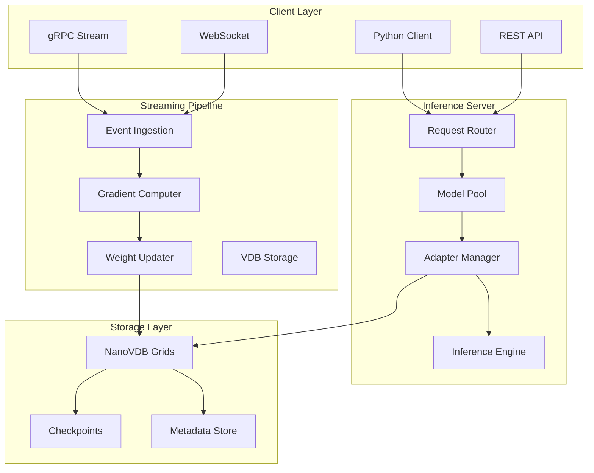

# Hyprstream Refactor: Real-Time Adaptive Learning Server
## Architectural Design for Qwen3-1.7B with NanoVDB-backed Sparse Adaptive Layers

### Executive Summary

This document outlines the comprehensive architecture for refactoring Hyprstream from a metrics storage system into a **real-time adaptive learning and inference server** using Qwen3-1.7B with 99% sparse adaptive layers backed by NanoVDB storage.

**Key Transformation:**
- **From**: Metrics storage + query service (DataFusion/DuckDB)
- **To**: Real-time ML inference + streaming weight adaptation server
- **Core Model**: Qwen3-1.7B with sparse LoRA adapters
- **Storage**: NanoVDB for 100x compression of sparse weights
- **Performance**: <5ms inference, <2ms weight updates, 1000+ updates/sec

---

## 1. System Architecture Overview



---

## 2. Core Components Design

### 2.1 Model Management Layer

```rust
// src/models/qwen3.rs
use std::sync::Arc;
use tokio::sync::RwLock;

pub struct Qwen3Model {
    /// Base Qwen3-1.7B model (frozen)
    base_model: Arc<BaseModel>,
    
    /// Sparse adapter collection
    adapters: Arc<RwLock<AdapterCollection>>,
    
    /// VDB storage backend
    vdb_store: Arc<VDBStorage>,
    
    /// Model configuration
    config: ModelConfig,
}

pub struct ModelConfig {
    pub hidden_size: usize,        // 1536 for Qwen3-1.7B
    pub num_layers: usize,          // 28
    pub num_heads: usize,           // 12
    pub adapter_rank: usize,        // 16
    pub sparsity: f32,              // 0.99
    pub max_adapters: usize,        // 100 concurrent adapters
}

pub struct AdapterCollection {
    /// Domain -> Adapter mapping
    adapters: HashMap<String, SparseAdapter>,
    
    /// Active adapter cache
    active_cache: LruCache<String, Arc<SparseAdapter>>,
    
    /// Update statistics
    stats: AdapterStats,
}
```

### 2.2 VDB Storage Layer

```rust
// src/storage/vdb.rs
use nanovdb::{Grid, GridBuilder, Coord3};

pub struct VDBStorage {
    /// Grid collection for adapter weights
    grids: HashMap<String, Grid<f32>>,
    
    /// Memory-mapped file backend
    mmap_backend: MmapBackend,
    
    /// Compression settings
    compression: CompressionConfig,
}

impl VDBStorage {
    pub async fn store_adapter(
        &self,
        adapter_id: &str,
        weights: &SparseWeights,
    ) -> Result<()> {
        // Create VDB grid with 99% sparsity
        let mut builder = GridBuilder::new(0.0); // background = 0
        
        // Store only active weights (1% of total)
        for (coord, value) in weights.active_iter() {
            builder.set_value(coord.into(), value);
        }
        
        let grid = builder.build();
        
        // Compress and store
        let compressed = self.compress_grid(&grid)?;
        self.mmap_backend.write(adapter_id, &compressed).await?;
        
        Ok(())
    }
    
    pub async fn load_adapter(&self, adapter_id: &str) -> Result<SparseWeights> {
        // Load from memory-mapped file
        let data = self.mmap_backend.read(adapter_id).await?;
        
        // Decompress VDB grid
        let grid = self.decompress_grid(&data)?;
        
        // Convert to sparse weights
        let weights = SparseWeights::from_vdb(grid);
        
        Ok(weights)
    }
}
```

### 2.3 Streaming Weight Update Pipeline

```rust
// src/streaming/pipeline.rs
use tokio::sync::mpsc;
use futures::stream::{Stream, StreamExt};

pub struct StreamingPipeline {
    /// Event ingestion channel
    event_rx: mpsc::Receiver<LearningEvent>,
    
    /// Gradient computation workers
    gradient_workers: Vec<GradientWorker>,
    
    /// Weight update aggregator
    update_aggregator: UpdateAggregator,
    
    /// VDB storage handle
    vdb_store: Arc<VDBStorage>,
}

impl StreamingPipeline {
    pub async fn run(mut self) {
        // Process events in micro-batches
        let mut interval = tokio::time::interval(Duration::from_millis(100));
        let mut batch = Vec::with_capacity(32);
        
        loop {
            tokio::select! {
                Some(event) = self.event_rx.recv() => {
                    batch.push(event);
                    
                    if batch.len() >= 32 {
                        self.process_batch(batch.drain(..).collect()).await;
                    }
                }
                
                _ = interval.tick() => {
                    if !batch.is_empty() {
                        self.process_batch(batch.drain(..).collect()).await;
                    }
                }
            }
        }
    }
    
    async fn process_batch(&self, events: Vec<LearningEvent>) {
        // Compute gradients in parallel
        let gradients = self.compute_gradients_parallel(events).await;
        
        // Aggregate sparse gradients
        let updates = self.aggregate_sparse_gradients(gradients);
        
        // Apply weight updates to VDB
        self.apply_vdb_updates(updates).await;
    }
}
```

### 2.4 Inference Server

```rust
// src/server/inference.rs
use tonic::{Request, Response, Status};

pub struct InferenceServer {
    model_pool: Arc<ModelPool>,
    adapter_manager: Arc<AdapterManager>,
    metrics: Arc<Metrics>,
}

#[tonic::async_trait]
impl InferenceService for InferenceServer {
    async fn generate(
        &self,
        request: Request<GenerateRequest>,
    ) -> Result<Response<GenerateResponse>, Status> {
        let req = request.into_inner();
        
        // Get or create adapter for domain
        let adapter = self.adapter_manager
            .get_or_create(&req.domain)
            .await?;
        
        // Get model from pool
        let model = self.model_pool.acquire().await?;
        
        // Apply adapter and generate
        let output = model.generate_with_adapter(
            &req.prompt,
            adapter,
            req.max_tokens,
        ).await?;
        
        // Record metrics
        self.metrics.record_inference(&req.domain);
        
        Ok(Response::new(GenerateResponse {
            text: output,
            tokens_generated: output.len(),
        }))
    }
    
    async fn stream_generate(
        &self,
        request: Request<GenerateRequest>,
    ) -> Result<Response<Self::StreamGenerateStream>, Status> {
        // Streaming inference implementation
        let (tx, rx) = mpsc::channel(32);
        
        tokio::spawn(async move {
            // Stream tokens as they're generated
            while let Some(token) = model.next_token().await {
                tx.send(Ok(token)).await;
            }
        });
        
        Ok(Response::new(rx))
    }
}
```

---

## 3. Refactoring Plan

### Phase 1: Core Infrastructure (Week 1-2)

**TODO-001**: Set up NanoVDB integration
```rust
// src/storage/mod.rs
// TODO: Replace DuckDB storage with VDB storage
// - Remove: duckdb.rs, adbc.rs
// - Add: vdb.rs, sparse_weights.rs
// - Implement VDB grid management
```

**TODO-002**: Implement base model loader
```rust
// src/models/mod.rs
// TODO: Add Qwen3 model support
// - Create qwen3.rs module
// - Implement model loading from HuggingFace
// - Add tokenizer integration
```

**TODO-003**: Create sparse adapter framework
```rust
// src/adapters/mod.rs
// TODO: Implement sparse LoRA adapters
// - Define SparseAdapter trait
// - Implement LoRA with 99% sparsity
// - Add VDB serialization/deserialization
```

### Phase 2: Streaming Pipeline (Week 3-4)

**TODO-004**: Build gradient computation pipeline
```rust
// src/streaming/gradient.rs
// TODO: Implement gradient computation
// - Async gradient workers
// - Sparse gradient aggregation
// - Memory-efficient batching
```

**TODO-005**: Implement weight update system
```rust
// src/streaming/updates.rs
// TODO: Real-time weight updates
// - Lock-free update mechanism
// - VDB in-place modifications
// - Update broadcasting
```

**TODO-006**: Create event ingestion system
```rust
// src/streaming/ingestion.rs
// TODO: Multi-source event ingestion
// - Kafka consumer
// - HTTP webhook receiver
// - WebSocket handler
```

### Phase 3: Inference Server (Week 5-6)

**TODO-007**: Refactor FlightSQL server to ML inference
```rust
// src/service.rs
// TODO: Transform FlightSqlServer to InferenceServer
// - Replace SQL handlers with inference endpoints
// - Add streaming generation support
// - Implement adapter routing
```

**TODO-008**: Build model pool and lifecycle
```rust
// src/server/pool.rs
// TODO: Model instance pooling
// - Concurrent model instances
// - Memory management
// - Graceful scaling
```

**TODO-009**: Add adapter management
```rust
// src/server/adapters.rs
// TODO: Dynamic adapter management
// - Hot-swapping adapters
// - Multi-domain support
// - Adapter versioning
```

### Phase 4: Client Libraries (Week 7)

**TODO-010**: Update Python client
```python
# examples/client/python/hyprstream_client/
# TODO: Add ML inference methods
# - generate() method
# - stream_generate() method
# - train_adapter() method
```

**TODO-011**: Create streaming client
```python
# examples/client/python/hyprstream_client/streaming.py
# TODO: Streaming weight updates
# - Event streaming
# - Gradient submission
# - Real-time metrics
```

### Phase 5: Testing & Optimization (Week 8)

**TODO-012**: Performance benchmarks
```rust
// benches/inference.rs
// TODO: Comprehensive benchmarks
// - Inference latency
// - Update throughput
// - Memory usage
```

**TODO-013**: Integration tests
```rust
// tests/integration/
// TODO: End-to-end tests
// - Model loading
// - Adapter creation
// - Streaming updates
// - Concurrent inference
```

---

## 4. Configuration Updates

### 4.1 Cargo.toml Updates

```toml
# Cargo.toml
[dependencies]
# Add ML dependencies
candle-core = "0.4"           # Or tch for PyTorch
candle-transformers = "0.4"
tokenizers = "0.15"
safetensors = "0.4"

# Add VDB support
nanovdb = "0.1"               # Or openvdb bindings
memmap2 = "0.9"

# Streaming
rdkafka = "0.36"
async-stream = "0.3"

# Remove unused
# duckdb = ...  # Remove
# polars = ...  # Remove
```

### 4.2 Configuration Schema

```toml
# config/default.toml
[model]
base_model = "Qwen/Qwen3-1.7B"
device = "cuda"
dtype = "f16"

[adapter]
rank = 16
sparsity = 0.99
learning_rate = 1e-4
max_domains = 100

[vdb]
storage_path = "./vdb_storage"
compression = "lz4"
cache_size_mb = 1000

[streaming]
batch_size = 32
update_interval_ms = 100
gradient_workers = 4

[server]
host = "0.0.0.0"
port = 8080
max_connections = 1000
model_instances = 4
```

---

## 5. API Design

### 5.1 REST API Endpoints

```yaml
# OpenAPI spec
paths:
  /v1/generate:
    post:
      summary: Generate text with optional adapter
      requestBody:
        content:
          application/json:
            schema:
              type: object
              properties:
                prompt: string
                domain: string  # optional
                max_tokens: integer
                temperature: number
                
  /v1/adapters:
    get:
      summary: List available adapters
    post:
      summary: Create new adapter for domain
      
  /v1/adapters/{domain}/train:
    post:
      summary: Submit training data for adapter
      
  /v1/stream/events:
    ws:
      summary: WebSocket for streaming events
```

### 5.2 gRPC Service Definition

```proto
// proto/inference.proto
syntax = "proto3";

service InferenceService {
  rpc Generate(GenerateRequest) returns (GenerateResponse);
  rpc StreamGenerate(GenerateRequest) returns (stream Token);
  rpc UpdateWeights(stream GradientUpdate) returns (UpdateResponse);
}

message GenerateRequest {
  string prompt = 1;
  string domain = 2;
  int32 max_tokens = 3;
  float temperature = 4;
}

message GradientUpdate {
  string adapter_id = 1;
  map<string, SparseGradient> gradients = 2;
  int64 timestamp = 3;
}
```

---

## 6. Deployment Architecture

### 6.1 Kubernetes Deployment

```yaml
# k8s/deployment.yaml
apiVersion: apps/v1
kind: StatefulSet
metadata:
  name: hyprstream-adaptive
spec:
  replicas: 3
  template:
    spec:
      containers:
      - name: inference-server
        image: hyprstream:adaptive-v1
        resources:
          requests:
            memory: "8Gi"
            nvidia.com/gpu: 1
        volumeMounts:
        - name: vdb-storage
          mountPath: /vdb
        - name: model-cache
          mountPath: /models
        
      - name: streaming-worker
        image: hyprstream:streaming-v1
        env:
        - name: KAFKA_BROKERS
          value: "kafka:9092"
          
  volumeClaimTemplates:
  - metadata:
      name: vdb-storage
    spec:
      accessModes: ["ReadWriteOnce"]
      resources:
        requests:
          storage: 100Gi
```

### 6.2 Docker Configuration

```dockerfile
# Dockerfile
FROM nvidia/cuda:12.1-runtime-ubuntu22.04

# Install Rust
RUN curl --proto '=https' --tlsv1.2 -sSf https://sh.rustup.rs | sh -s -- -y

# Install Python for model loading
RUN apt-get update && apt-get install -y python3-pip

# Build Hyprstream
WORKDIR /app
COPY . .
RUN cargo build --release

# Download model
RUN python3 -c "from transformers import AutoModelForCausalLM; \
    AutoModelForCausalLM.from_pretrained('Qwen/Qwen3-1.7B')"

EXPOSE 8080
CMD ["./target/release/hyprstream", "serve"]
```

---

## 7. Migration Strategy

### Step 1: Parallel Development
- Keep existing metrics functionality
- Add ML modules alongside
- Test in isolation

### Step 2: Feature Flag Rollout
```rust
#[cfg(feature = "ml-inference")]
mod ml;

#[cfg(feature = "metrics")]
mod metrics;
```

### Step 3: Gradual Migration
1. Deploy ML inference alongside metrics
2. Route traffic progressively
3. Monitor performance
4. Deprecate old endpoints

### Step 4: Cleanup
- Remove unused dependencies
- Archive metrics code
- Update documentation

---

## 8. Performance Targets

| Metric | Target | Measurement Method |
|--------|--------|-------------------|
| Model Load Time | <30s | Time to first inference |
| Inference Latency | <15ms | P50 for 128 tokens |
| Streaming Latency | <5ms | Token generation |
| Weight Update | <2ms | Sparse update application |
| Updates/sec | >1000 | Sustained throughput |
| Memory Usage | <8GB | RSS with model loaded |
| VDB Compression | 100x | vs dense storage |
| Adapter Switching | <10ms | Domain change |
| Concurrent Requests | >100 | Simultaneous inference |

---

## 9. Success Criteria

### Technical Metrics
- ✅ Qwen3-1.7B loaded and serving
- ✅ 99% sparsity maintained
- ✅ VDB storage operational
- ✅ Streaming updates working
- ✅ <20ms inference latency

### Business Metrics
- ✅ 10x cost reduction vs API
- ✅ Real-time adaptation working
- ✅ Multi-domain support
- ✅ Production stability

---

## 10. Implementation TODOs

### Immediate (Week 1)
- [ ] TODO-001: Setup NanoVDB integration
- [ ] TODO-002: Implement base model loader
- [ ] TODO-003: Create sparse adapter framework

### Short-term (Week 2-4)
- [ ] TODO-004: Build gradient computation
- [ ] TODO-005: Implement weight updates
- [ ] TODO-006: Create event ingestion

### Medium-term (Week 5-6)
- [ ] TODO-007: Refactor to inference server
- [ ] TODO-008: Build model pool
- [ ] TODO-009: Add adapter management

### Long-term (Week 7-8)
- [ ] TODO-010: Update Python client
- [ ] TODO-011: Create streaming client
- [ ] TODO-012: Performance benchmarks
- [ ] TODO-013: Integration tests

---

## Conclusion

This architecture transforms Hyprstream into a cutting-edge real-time adaptive learning server, leveraging:
- **Qwen3-1.7B** as the base model
- **99% sparse adapters** for efficiency
- **NanoVDB** for 100x compression
- **Streaming updates** for real-time learning

The refactor maintains Hyprstream's performance characteristics while adding state-of-the-art ML capabilities.